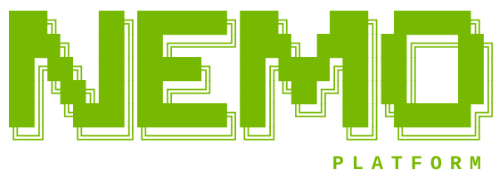
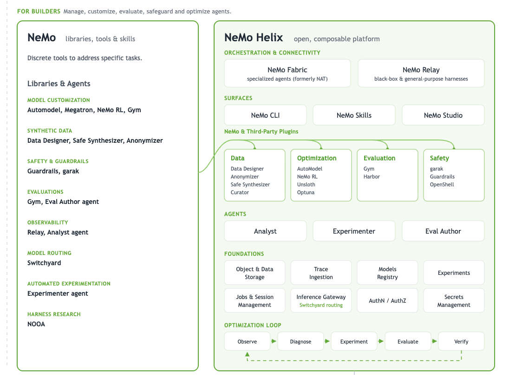

<!-- SPDX-FileCopyrightText: Copyright (c) 2025-2026 NVIDIA CORPORATION & AFFILIATES. All rights reserved. -->
<!-- SPDX-License-Identifier: Apache-2.0 -->

# NeMo Helix



[](https://github.com/NVIDIA-NeMo/nemo-helix/actions/workflows/ci.yaml)
[](LICENSE)
[](https://www.python.org/)
[](https://docs.nvidia.com/nemo-helix)

## Make the agents you ship faster, more accurate, and safer
NeMo Helix is an open source platform for improving and hardening production agents. Observe what your agent does, diagnose where it fails, run the experiments that fix it, and verify the result before it ships.

<p align="center">
  
</p>

## How Helix relates to the NeMo libraries

Helix composes a curated set of NeMo and third-party libraries. Each library does one job well. Getting them to work together is normally your problem: separate APIs, separate credentials, files you move by hand. As plugins in Helix they share one storage layer, one set of credentials, and one job runner, so what one produces, the next can read. 

- **Capabilities as plugins.** NeMo RL, AutoModel, and Unsloth for fine-tuning. NeMo Gym and Harbor for evaluation. Guardrails and garak for safety. Data Designer and Safe Synthesizer for synthetic data.
- **One interface, every capability.** A CLI, a Python SDK, and a REST API across every plugin, instead of a different client per library.
- **Agent-first.** You do not need to know which NeMo tool to use. Skills drive your coding agent through the job.
- **Human-accessible.** NeMo Studio ships with Helix, for the calls that are hard to make from a terminal: comparing runs, reading traces, approving changes.
- **Runs where you do.** Laptop for a prototype, Kubernetes for production, on-prem or air-gapped when that is the requirement.
- **Swappable infrastructure.** Agent execution, sandboxing, storage, secrets, auth, model management, and inference each ship with a default you can replace with your own.
- **Apache 2.0.** The source is in this repository. No hosted service, no proprietary core.

```bash
uv tool install "nemo-helix[all]"
nemo setup
```

## What is in the box

### Capabilities

| Domain | What it covers | Components |
|---|---|---|
| **Data** | Generate the training and evaluation data you do not have, and keep sensitive data out of it | Data Designer, Safe Synthesizer, Anonymizer, Curator |
| **Optimization** | Make the agent cheaper, faster, or more accurate | Post-training plugin (SFT, DPO, LoRA, distillation, embeddings), AutoModel, NeMo RL, Unsloth, Optuna, Switchyard routing, prompt and skill tuning |
| **Evaluation** | Score candidates against your benchmarks before you ship them | NeMo Gym environments, Harbor eval suites, LLM-as-judge, deterministic, agentic, and RAG metrics, experiments |
| **Safety** | Catch unsafe behavior before and during production | Guardrails (content safety, jailbreak detection, PII redaction), garak red-teaming, OpenShell sandboxing |
| **Connectivity & Observability** | Connect agents to Helix and see what they actually do in production | NeMo Fabric (specialized agents, formerly NAT), NeMo Relay (black-box and general-purpose harnesses), trace ingestion, session and cost inspection |

### Built-in agents

Two agents work the loop with you rather than waiting for you to drive it.

- **Analyst.** Reads production traces and surfaces where and why the agent is failing.
- **Eval Author.** Turns observed behavior into evaluation tasks so the failure does not come back.

### Surfaces

Every capability is reachable from every surface. Pick the one that fits the moment.

| Surface | Use it for |
|---|---|
| **NeMo CLI** | The primary interface. Every service under one command, one config, one context. |
| **NeMo Skills** | Agent skills installed into Claude Code, Cursor, Codex, or OpenCode, so your coding agent drives Helix in natural language. |
| **Python SDK and REST APIs** | Programmatic access for pipelines, services, and products built on Helix. |
| **NeMo Studio** | Optional web UI for chat, job monitoring, evaluation results, traces, experiments, and governance review. |

### Foundations

Shared services every capability builds on: object and data storage, trace ingestion, model registry, experiments, jobs and session management, inference gateway, authentication and authorization, and secrets management. Workspaces and projects scope every artifact, so what your team produces can be shared, referenced, and governed instead of copied between laptops.

**These are defaults, not lock-in.** Each foundation is an interface with a working implementation attached, so `nemo setup` gets you running in minutes. When you move to your own environment, swap them: point storage at your object store, the database at your managed Postgres and ClickHouse, identity at your IdP over OIDC, and inference at any OpenAI-compatible gateway.

## The optimization loop

Helix is organized around the loop that turns a working prototype into an agent that measurably improves over time. Each stage is usable on its own. Nothing forces you to adopt the whole loop on day one.

| Stage | What happens | What you use |
|---|---|---|
| **Observe** | Ingest traces from the running agent. Inspect sessions, tool calls, cost, and latency. Scan traces for PII and leaked credentials. | NeMo Relay, NeMo Fabric, trace ingestion, Anonymizer |
| **Diagnose** | Find where the agent fails and why. Cluster failures, compare against the incumbent, decide which lever is worth pulling. | Analyst agent, Experiments |
| **Experiment** | Generate the data you lack, fine-tune a smaller or open model, tune prompts and hyperparameters, or route by task complexity. | Data Designer, Safe Synthesizer, NeMo RL, AutoModel, Unsloth, Optuna, Switchyard |
| **Evaluate** | Score candidates on your benchmarks. Compare accuracy, cost, and latency against the baseline you are trying to beat. | NeMo Gym, Harbor, Evaluator metrics, Eval Author agent |
| **Verify** | Red-team the candidate, enforce input and output policy, and promote only what passes. | garak, Guardrails, OpenShell |


## When to use Helix vs standalone libraries
| Consider Helix if **any** of these is true | Consider the libraries if **each** of these is true |
|---|---|
| • Need multiple tools and libraries to work together<br>• Something outside your process needs to call the library: another team, another service, a non-Python client, a web UI<br>• It has to run in k8s, multi-tenant, with auth and an audit trail<br>• More than one team or capability needs to point at the same named object<br>• Your differentiation is the agents, not the plumbing | • The language of the library works with your workflow and architecture, for example a Python notebook on your laptop<br>• You do not need to share and persist artifacts such as data, model weights, and secrets in a consistent way<br>• You have opinions about your API conventions and you want to maintain those APIs indefinitely |

## Runs locally, scales to your cluster

The same platform, the same APIs, the same CLI at every size.

| | Local | Kubernetes |
|---|---|---|
| **For** | Prototyping, single developer, CI | Teams, production workloads, multinode training |
| **Install** | `uv tool install`, `nemo setup` | Helm chart |
| **State** | Embedded Postgres and ClickHouse | External or managed, replicated for HA |
| **Compute** | Hosted inference providers, no local GPU required | GPU nodes, Volcano for multinode jobs, OpenSandbox for isolated execution |
| **Access** | Local, single user | OIDC, scoped access keys, role bindings, policy engine, audit trail |

Supported on Linux (Ubuntu 22.04 and 24.04, RHEL 9, Rocky 9, Debian 12) and macOS (Sequoia and Tahoe, CLI and services only, no local GPU workloads). Clusters: minikube, kind, EKS, AKS, GKE, OKE, OpenShift, and on-prem.

You do not have to choose up front. Start on a laptop against a hosted provider and move to a cluster when the workload justifies it.

## Get Started

### Quick install from PyPI:

```bash
curl -LsSf https://astral.sh/uv/0.10.10/install.sh | sh
export PATH="$HOME/.local/bin:$PATH"
uv tool install "nemo-helix[all]"

nemo setup
```

`uv tool install` gives you a global `nemo` command in its own isolated environment, with nothing to activate. The `all` extra adds the Helix services, so `nemo services run` works; without it you get the SDK and CLI only. To import the SDK from your own code, `uv pip install "nemo-helix[all]"` into a virtual environment instead.

### Source checkout for development:

```bash
git clone https://github.com/NVIDIA-NeMo/nemo-helix.git
cd nemo-helix

# Install Flox first: https://flox.dev/docs/install-flox/install
make bootstrap
flox -q activate

nemo setup
```

`make bootstrap` uses the Flox-pinned uv, Node.js, and pnpm toolchain; it does not require a prior `flox -q activate`. Activate Flox after bootstrap to continue development in the managed environment. Without Flox, install the versions printed by `make toolchain-versions` and a C compiler, then run `make TOOLCHAIN=system bootstrap` followed by `source .venv/bin/activate`. See [SETUP.md](SETUP.md#toolchain-uv-nodejs-pnpm).

`nemo setup` starts local services, registers your LLM provider, discovers available models, selects default and fast agent models, installs agent skills, and deploys a sample agent (see more below).

Review [Telemetry and Privacy](docs/telemetry-and-privacy.mdx) for the omnibus disclosure covering anonymous telemetry, bundled library telemetry, third-party endpoint notes, and opt-out controls.

See **[SETUP.md](SETUP.md)** for the full source setup playbook (local data dir, DB reset, manual service start, troubleshooting).

**Verify:**

```bash
nemo services status
```

To permanently reset local state, follow the explicitly confirmed, guarded
sequence in [SETUP.md](SETUP.md#question-3--wipe-local-platform-data). It removes
the managed ClickHouse container before deleting any bind-mounted data.

<details>
<summary>Useful CLI commands once setup completes</summary>

```bash
nemo --help                # All commands
nemo models list           # Available models
nemo chat                  # Chat with your default model
nemo services status       # platform health
nemo skills list           # Skills installed on the platform
```

Every capability is also available via REST API. Model inference uses the model IDs returned from `nemo models list` and is available at:

```text
http://localhost:8080/apis/inference-gateway/v2/workspaces/default/openai/-/v1/chat/completions
```

To run Helix services in the foreground in a separate terminal (instead of the background process `nemo setup` starts):

```bash
nemo services run
```

</details>

<details>
<summary>Studio (web UI) bootstrap troubleshooting</summary>

If `make bootstrap` reports that Studio asset bootstrap did not complete, the API still runs but the web UI is unavailable until the bundle is built. Ensure Flox is installed, or provide the versions printed by `make toolchain-versions` with `TOOLCHAIN=system`, then run `make bootstrap-studio` from the repository root.

</details>

<details>
<summary>Non-interactive setup (for agents, CI, or scripts)</summary>

```bash
export NVIDIA_API_KEY=nvapi...
export NEMO_DEFAULT_MODEL=nvidia-nemotron-3-super-120b-a12b
export NEMO_FAST_MODEL="$NEMO_DEFAULT_MODEL"
nemo setup --auto --start-services --install-skills
```

</details>

## Use NeMo Helix from your coding agent

After installation, launch your coding agent (Claude Code, Codex, Cursor, OpenCode, etc) from inside the `nemo-helix` directory. This is the primary way of interacting with the NeMo Helix.

Things you can ask it to do, once the platform is running:

- "Scaffold an agent from this spec and deploy it."
- "Run an evaluation against my agent."
- "Add content-safety guardrails to my agent."
- "Help me optimize my agent."
- "Show me what's running on the platform."
- "Shut down NeMo cleanly."


## Release notes

See the [current release notes](https://docs.nvidia.com/nemo-helix/documentation/reference/release-notes/current-release) for the latest features, improvements, and known limitations.

## Skills

`nemo setup` detects Claude Code, Cursor, Codex, and OpenCode and installs NeMo skills into your agent of choice, either into the local directory or globally. NeMo Helix-level skills live under `packages/nemo_helix_ext/src/nemo_helix_ext/skills/` and ship with the `nemo-helix` package; plugin-owned skills live under `plugins/<plugin>/src/<plugin>/skills/`.

To install or refresh skills for a built-in coding agent, use `--agent`. For another Agent Skills-compatible harness, point `--path` at that harness's skills directory.

```bash
nemo skills install --agent claude
nemo skills install --agent claude --skill nemo-build-agent --skill nemo-status
nemo skills install --path ~/.my-agent/skills
nemo setup --install-skills --skills-path ~/.my-agent/skills
```

## Try the sample agent

Interactive `nemo setup` can create a `sample` workspace with a Fabric-based
email security agent and evaluation artifacts. Open the Studio link printed at
the end of setup to explore them.

## Build on Helix

If you are building an internal agent stack or a customer-facing optimization product, Helix is meant to be the layer you build on, not the product you ship.

- Every capability is a REST API under `/apis/{service}/v2/workspaces/{workspace}/...`, with OpenAPI specs in [`openapi/`](openapi).
- Multi-tenancy is native: workspaces, projects, entity references, and per-workspace scoping across every service.
- Access control supports OIDC (Azure AD / Entra ID, generic OIDC), scoped access keys, role bindings, and a policy engine, including plugin-level authorization.
- The plugin model is the one the first-party capabilities use, so your own services become first-class in the CLI, the SDK, and Studio. Start from [`plugins/example-plugin`](plugins/example-plugin).
- Apache 2.0. Fork it, extend it, ship it inside your product.

## Documentation

Full documentation: [NeMo Helix docs](https://docs.nvidia.com/nemo-helix)

- [Telemetry and privacy](https://docs.nvidia.com/nemo-helix/documentation/reference/telemetry-and-privacy): anonymous telemetry, data collection, and opt-out controls.
- [Setup](https://docs.nvidia.com/nemo-helix/documentation/get-started): installation, providers, SDK.
- [CLI reference](https://docs.nvidia.com/nemo-helix/documentation/reference/cli-reference): all commands.
- [API reference](https://docs.nvidia.com/nemo-helix/documentation/reference/api-reference): REST endpoints.

## Development

See [CONTRIBUTING.md](CONTRIBUTING.md) for development workflow.
See [TESTING.md](TESTING.md) for testing strategy.

## License

NeMo Helix is licensed under the Apache License 2.0. Third-party open-source dependencies have their own licenses; review them before use.
