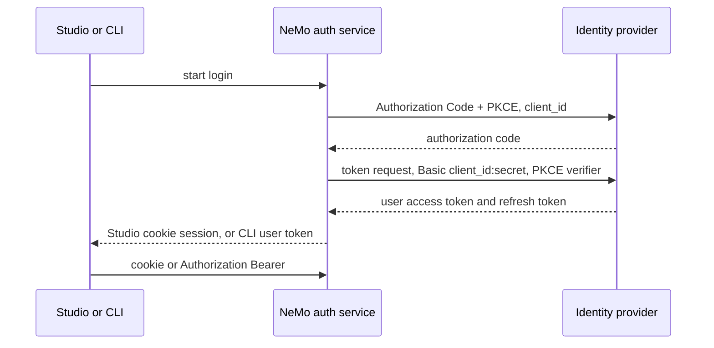

Use this page when your identity provider requires a confidential OAuth client with Client Secret Basic. NeMo Helix's auth service is that client. Studio and the CLI never see the client secret.



## Register the application

1. Create an Authorization Code + PKCE application in the identity provider.
2. Set token endpoint authentication to Client Secret Basic.
3. Register one redirect URI: `https://<nemo-host>/apis/auth/v2/login/callback`.
4. Do not register the CLI's localhost address. The CLI browser returns to NeMo, and NeMo finishes the handoff on `127.0.0.1`.

## Configure NeMo Helix

Store the client secret and the session encryption key in the process environment. The config file stores only the variable names.

```yaml
auth:
  enabled: true
  oidc:
    enabled: true
    issuer: "https://idp.example.com"
    client_id: "<confidential-client-id>"
    token_endpoint_auth_method: client_secret_basic
    client_secret_env_var: NHX_OIDC_CLIENT_SECRET
    session_encryption_key_env_var: NHX_AUTH_SESSION_ENCRYPTION_KEY
```

Mount both environment variables into the auth service from your deployment secret store. Do not put either value in Helm values, the Studio bundle, discovery output, or CLI configuration. Provider refresh tokens used by the CLI stay encrypted on the server.

`client_id` is the default login client. Add `public_client_id` only when this deployment also has a separate public client for device flow. That public client is never the default.

Studio signs in through the cookie session. `nemo auth login` stores the user access token and sends `Authorization: Bearer` on later API calls. Refresh for that login goes back through NeMo, which still holds the client secret.

Password grant is not available for this client. Run `nemo auth login` and complete the browser prompt.

Signing out of Studio revokes the NeMo web session. It does not end the identity provider's browser session.

## Verify the setup

1. Sign in to Studio and confirm an API view loads.
2. Run `nemo auth login` on a machine that does not have the client secret, then run `nemo workspaces list`.
3. Request `/apis/auth/discovery` and confirm the response contains `token_endpoint_auth_method: client_secret_basic` but no client secret or secret environment variable name.

## Troubleshoot login

- **`invalid_client`**: Confirm `NHX_OIDC_CLIENT_SECRET` is mounted and belongs to the configured `client_id`.
- **Redirect URI mismatch**: Register the NeMo callback exactly. Do not register `localhost` or a Studio route at the identity provider.
- **CLI starts device flow**: Confirm discovery reports `client_secret_basic`; otherwise the deployment is still advertising a public platform client or stale discovery data.
