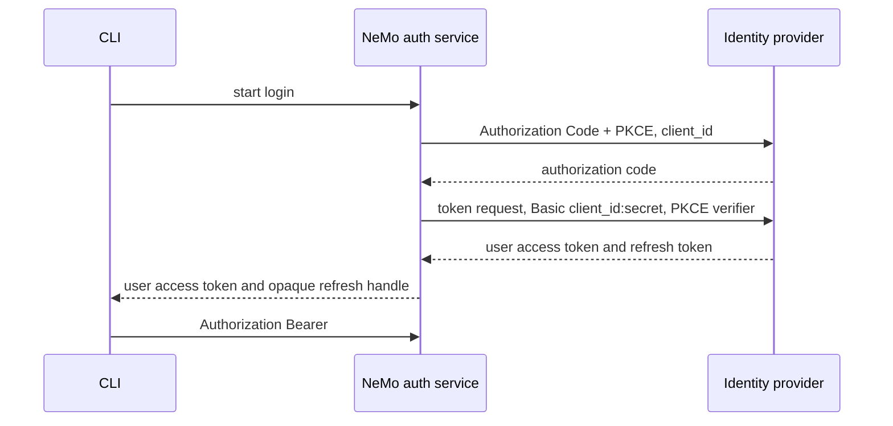

Use this page when your identity provider requires a confidential OAuth client with Client Secret Basic. NeMo Helix's auth service is that client, so the CLI never sees the client secret.

<Warning>
  Studio login does not use the confidential broker yet. Keep the platform client public when users need Studio access. Confidential Studio sessions will be added separately.
</Warning>



## Register the application

1. Create an Authorization Code + PKCE application in the identity provider.
2. Set token endpoint authentication to Client Secret Basic.
3. Register one redirect URI: `https://<nemo-host>/apis/auth/v2/login/callback`.
4. Do not register the CLI's localhost address. The CLI browser returns to NeMo, and NeMo finishes the handoff on `127.0.0.1`.

## Configure NeMo Helix

Store the client secret and broker encryption key in the process environment. The config file stores only the variable names.

```yaml
platform:
  # Address used by services to connect to Helix.
  base_url: "http://nemo-helix-envoy.nemo-helix.svc:8080"
  # Public origin used in discovery and browser redirects.
  advertised_base_url: "https://nemo.example.com"

auth:
  enabled: true
  oidc:
    enabled: true
    issuer: "https://idp.example.com"
    server_sessions:
      encryption_key_env_var: NHX_AUTH_SESSION_ENCRYPTION_KEY
    confidential_client:
      client_id: "<confidential-client-id>"
      client_secret_env_var: NHX_OIDC_CLIENT_SECRET
      authorization_endpoint: "https://idp.example.com/oauth2/authorize"
      # This endpoint is called by the auth service and may be internal.
      token_endpoint: "http://idp.identity.svc/oauth2/token"
      login_redirect_uri: "https://nemo.example.com/apis/auth/v2/login/callback"
      default_scopes: "openid profile email offline_access"
```

Create these values as deployment secrets and expose them to the API/auth
service process as environment variables. In Helm deployments, use a Kubernetes
Secret managed by your normal secret tooling, such as External Secrets, Vault,
Sealed Secrets, or a manually created Secret. Inject it with the chart's
top-level `envFromSecret` value when the Secret contains the full API
environment, or with `api.env` when you want explicit `secretKeyRef` entries:

```yaml
api:
  env:
    NHX_OIDC_CLIENT_SECRET:
      valueFrom:
        secretKeyRef:
          name: nemo-oidc-client
          key: client-secret
    NHX_AUTH_SESSION_ENCRYPTION_KEY:
      valueFrom:
        secretKeyRef:
          name: nemo-oidc-client
          key: session-encryption-key
```

Generate both values and confirm they are present on the API pods before you
add `confidential_client`. A confidential client requires the session key.
Public-client web sessions are separate: set
`public_client.server_side_sessions` only when you want them. Both use the same
`server_sessions` key. See
[Deployment Secrets](/documentation/access-control/deployment/deployment-secrets).
Do not put either secret value in `platformConfig`, Helm values that render to a
ConfigMap, the Studio bundle, discovery output, or CLI configuration. Provider
refresh tokens used by the CLI stay encrypted on the server.

`public_client` and `confidential_client` are independent profiles. A
confidential-only deployment advertises the confidential profile as the default
CLI login. When both profiles are configured, the public profile remains the
default and supports Studio and device flow. Each profile has its own client ID,
endpoints, scopes, and bearer-token policy. The shared `server_sessions` block
configures encryption for broker-managed provider tokens. Confidential clients
always use it; a public client uses it only when `server_side_sessions: true`.

`platform.base_url` is the connection address used by running Helix services.
`platform.advertised_base_url` is the public HTTP or HTTPS origin included in
discovery and browser redirects. It defaults to `base_url`. Set it explicitly
when the connection address is internal, uses a Unix socket, or differs from
the gateway origin seen by users.

`nemo auth login` stores the user access token and sends `Authorization: Bearer` on later API calls. Refresh for that login goes back through NeMo, which still holds the client secret.

Password grant is not available for this client. Run `nemo auth login` and complete the browser prompt.

## Verify the setup

1. Run `nemo auth login` on a machine that does not have the client secret, then run `nemo workspaces list`.
2. Request `/apis/auth/discovery` and confirm the response contains `client_authentication: client_secret_basic` but no client secret or secret environment variable name.

## Troubleshoot login

- **`invalid_client`**: Confirm `NHX_OIDC_CLIENT_SECRET` is mounted and belongs to `confidential_client.client_id`.
- **Redirect URI mismatch**: Register the NeMo callback exactly. Do not register the CLI's localhost callback at the identity provider.
- **CLI starts device flow**: Confirm discovery reports `client_secret_basic`; otherwise the deployment is still advertising a public platform client or stale discovery data.
