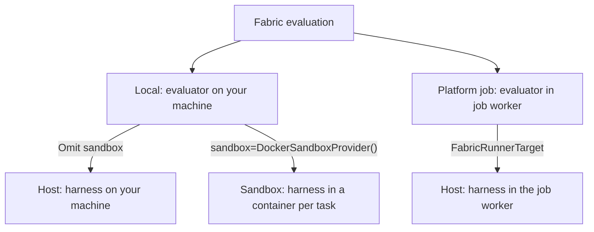

[NeMo Fabric](https://github.com/nvidia/nemo-fabric) runs an agent **harness** rather than a single
agent. Which harness runs is selected entirely by `config["harness"]["adapter_id"]`, so one runtime
covers several agent frontends without changing your evaluation. Fabric returns an **ATIF
trajectory** alongside the final answer, so a metric can score *how* the agent worked, not just what
it answered.

The result and bundle are the same as the
[quickstart](/documentation/evaluate-models/agent-eval/quickstart) — only the runner changes.

This runner executes the harness on the host. To run a Fabric harness inside Harbor's Docker sandbox and
score it with a Harbor verifier instead, see
[Run a NeMo Fabric Agent inside Harbor](/documentation/evaluate-models/agent-eval/harbor-fabric-agent).

## Harnesses

| `adapter_id` | Harness | Execution |
|---|---|---|
| `nvidia.fabric.codex` | Codex | Selected by the Fabric adapter |
| `nvidia.fabric.claude` | Claude | Selected by the Fabric adapter |
| `nvidia.fabric.hermes` | Hermes SDK | Selected by the Fabric adapter |
| `nvidia.fabric.langchain.deepagents` | LangChain deepagents | Selected by the Fabric adapter |

<Warning>

This runner is **not** zero-dependency. It needs:

- **The harness adapters**, from the `fabric` extra:

  ```bash
  uv sync --frozen --package nemo-evaluator-sdk --extra fabric --inexact
  ```

- **The `nemo-relay` gateway binary**, when capturing trajectories for out-of-process harnesses.
  The pip package ships bindings only, so the daemon comes from a GitHub release asset:

  ```bash
  script/dev-install-fabric.sh
  ```

- **The harness's own runtime**, when required by the selected adapter — for example, `codex` on
  `PATH` and authenticated for the Codex adapter.

The `fabric` extra installs the Codex, Claude, and Hermes adapters. The deepagents adapter is
deliberately excluded from it, because that adapter does not support the Relay observability
configuration Fabric streaming generates; install its harness separately if you need it.

</Warning>

## Execution terms

These terms describe two separate choices:

- **Local or platform job:** where the evaluator runs — on your machine or in a platform job worker.
- **Host or sandbox:** where the agent harness runs — in the evaluator's environment or in a separate
  container for each task.



- **Local host:** `FabricAgentRuntime(config)` runs the harness on your machine. See [Run it](#run-it).
- **Local sandbox:** `FabricAgentRuntime(config, sandbox=DockerSandboxProvider())` runs the harness
  in a task container. The evaluator still runs on your machine. See [Running in a sandbox](#running-in-a-sandbox).
- **Platform job:** `FabricRunnerTarget` uses host mode inside the job
  worker within a container; host mode here means running inside that worker.
  The target currently has no per-task sandbox option. See [Submit as a platform job](#submit-as-a-platform-job).

## The agent config

One mapping describes the whole agent — harness, runtime, environment, and model. This example
uses Codex with its existing local login (verify login status with `codex login status`):

```python
config = {
    "schema_version": "fabric.agent/v1alpha1",
    "metadata": {"name": "eval-fabric"},
    "harness": {
        "adapter_id": "nvidia.fabric.codex",
        "resolution": "preinstalled",
        "settings": {"sandbox": "workspace-write"},
    },
    "runtime": {
        "input_schema": "text",
        "output_schema": "message",
    },
    "environment": {"provider": "local"},
    "models": {"default": {"provider": "openai", "model": "<provider-model>"}},
    "telemetry": {"enabled": False},
}
```

- A **model role** is a name you choose as a key in `config["models"]`. In this example,
  `"default"` is the role, and `config["models"]["default"]` contains its provider and model settings.
  Other role names, such as `"judge"`, are also keys in that mapping.

An `environment.workspace` set here is **overridden per task** — the runtime gives every task its own
fresh workspace under `work_root`, so setting one in the config has no effect.

Across harnesses the shape differs mainly in `adapter_id` and any
harness-specific `harness.settings`. The selected adapter determines how it runs the harness:
Codex invokes its CLI, while Hermes uses its SDK. For complete Codex-CLI and Hermes-SDK
configurations, see `examples/fabric_harness_runtimes.py` in the SDK.

## Run it

### Prerequisites
- Run `codex login` if needed, then verify `codex login status` in the environment running Python;
  see [Codex authentication](https://developers.openai.com/codex/auth/).
- Replace `<provider-model>` in the config above with a model available to your Codex account.
- Save the config above and the snippet below as `run_fabric_eval.py`, then run
  `uv run --with 'nemo-fabric-adapters-codex[harness]>=0.3,<0.4' run_fabric_eval.py`.
  The `harness` extra supplies the Codex Python SDK used by the adapter; installing the CLI alone
  does not supply that Python dependency.

This local host example uses your saved Codex login, so it needs no `env_secrets` or API key export.
The login is not automatically available in task containers or platform job workers; see
[Secrets](#secrets) for explicit credentials in those environments.

```python
from pathlib import Path

from nemo_evaluator_sdk import StringCheckMetric
from nemo_evaluator_sdk.agent_eval.evaluator import AgentEvaluator
from nemo_evaluator_sdk.agent_eval.runtimes.fabric.runtime import FabricAgentRuntime
from nemo_evaluator_sdk.agent_eval.tasks import AgentEvalRunConfig, AgentEvalTask

tasks = [
    AgentEvalTask(
        id="reply-ok",
        intent="Reply with a fixed token.",
        inputs={"instruction": "Reply with the word OK."},
        metrics=[
            StringCheckMetric(
                operation="contains",
                left_template="{{sample.output_text}}",
                right_template="OK",
            )
        ],
    )
]

runtime = FabricAgentRuntime(
    config=config, # from the snippet above
    work_root="fabric",
    capture_trajectory=False,
)

result = AgentEvaluator().run_sync(
    tasks=tasks,
    target=runtime,
    config=AgentEvalRunConfig(work_dir=Path("out"), parallelism=1),
)

bundle = result.persist()

for trial in result.trials:
    print("Status:", trial.status)
    if trial.error is not None:
        print("Error:", trial.error)
    elif trial.metadata.get("error"):
        print("Error:", trial.metadata["error"])
    if trial.output is not None:
        print("Answer:", trial.output.output_text)
for score in result.summary.scores.scores:
    print(f"Score: {score.name} = {score.mean}")

print("Results:", bundle.output_dir.resolve())
```

### Configuration

| Field | Required | Notes |
|---|---|---|
| `config` | yes | the agent config mapping above |
| `model` | no | overrides `models.default.model`, the selected model within the same provider, preserving its connection and settings |
| `base_dir` | no | base directory for relative paths in the config |
| `work_root` | no | where Fabric's per-run working directories are created |
| `timeout_s` | no | overall run timeout, default `600` |
| `capture_trajectory` | no | when `True`, the runner captures the ATIF trajectory as evidence, default `True` |
| `trajectory_extra` | no | extra fields merged into the captured trajectory |
| `runtime_name` | no | the runner name recorded in evaluation metadata, default `fabric` |
| `skills` | no | skills injected into the agent's workspace |
| `sandbox` | no | a `SandboxProvider`; when set, each task runs inside a sandbox (see below) |
| `image` | no | the sandbox image; only valid with `sandbox` |
| `env_secrets` | no | `{ENV_NAME: SecretRef}` credentials for host or sandbox execution |
| `secret_resolver` | no | must implement `EnvSecretSource` protocol; defaults to `LocalSecretResolver` for standalone local runs |

## Secrets

- For standalone local evaluations without using nemo-helix, export credential variables before starting Python.
- For platform jobs, the platform injects credentials into the job worker's environment.

For model credentials, use both settings with the same environment-variable name:

- **`env_secrets`** identifies the secret to resolve.
- **`models.<role>.api_key_env`** connects that secret to a model. A role is a key such as `default`
  in the [agent config's `models` mapping](#the-agent-config).

### Local example: either exported variable

Export the credential under either name before starting Python:

```bash
export MY_WORKSPACE_NVIDIA_API_KEY="nvapi-..."
```

Or:

```bash
export NVIDIA_API_KEY="nvapi-..."
```

The same Python configuration works with either export. This separate example uses Hermes with
an NVIDIA model and an explicit credential binding. Install the Hermes harness in the same Python
environment as the evaluator (the repository environment is `.venv`):

```bash
uv pip install --python .venv/bin/python hermes-agent tomli-w
```

For platform jobs, install it in the job worker's environment or image as well. The default local
sandbox image already includes it.

```python
from nemo_evaluator_sdk.values.common import SecretRef

hermes_config = {
    "schema_version": "fabric.agent/v1alpha1",
    "metadata": {"name": "eval-hermes"},
    "harness": {"adapter_id": "nvidia.fabric.hermes", "resolution": "preinstalled"},
    "runtime": {"max_turns": 50},
    "environment": {"provider": "local"},
    "models": {
        "default": {
            "provider": "nvidia",
            "model": "<nvidia-model-id>",
            "base_url": "https://integrate.api.nvidia.com/v1",
            "api_key_env": "NVIDIA_API_KEY",
        },
    },
    "telemetry": {"enabled": False},
}

runtime = FabricAgentRuntime(
    hermes_config,
    env_secrets={
        "NVIDIA_API_KEY": SecretRef("my-workspace/nvidia-api-key"),
    },
)
```

### Lookup and execution

- **Local lookup:** for `SecretRef("my-workspace/nvidia-api-key")`, the resolver checks
  `MY_WORKSPACE_NVIDIA_API_KEY` first, then `NVIDIA_API_KEY`. It uses the first non-empty value.
  If both are set, the workspace-prefixed variable wins. If neither is set to a non-empty value,
  the resolver raises a configuration error naming the variables to export.
- **Host execution (local machine or platform job worker):** the runner points the model's
  `api_key_env` at the resolved source variable. In the example, it becomes
  `MY_WORKSPACE_NVIDIA_API_KEY` or stays `NVIDIA_API_KEY`, depending on which variable was found.
  The runner changes a configuration copy; it does not copy credentials into your process environment.
- **Sandbox execution:** the runner injects the resolved value into the task's container as
  `NVIDIA_API_KEY`. The model's `api_key_env` continues to name `NVIDIA_API_KEY`.
- **Custom credential names:** use the same name in `api_key_env` and as the `env_secrets` key.
  Lookup names come from the secret reference, so changing the declared key does not change
  which exported variables the local resolver checks.
- **Tool credentials:** whether the harness forwards injected variables to its tools depends on
  the adapter; Codex filters inherited variables.
- **Conflicting config values:** keep credential variables out of `config.environment.env`.
  The runner rejects entries that overlap an `env_secrets` key or, in host mode, its resolved source
  variable, since those entries could override the credential. Resolved values never enter
  Fabric's serialized configuration.

### Resolution timing and metadata

- **One evaluation** means all tasks passed to one `runtime.run_tasks(tasks, config)` call. The runner resolves
  references before any task starts or an image is built, so a configuration error stops the whole
  evaluation before work begins. Each task still receives its own workspace and configuration copy.
- **Credential refresh:** the runner resolves references again for each new evaluation.
  - In sandbox mode, the runner reads the values during preparation and uses them for every task in that evaluation.
  - In host mode, the runner selects variable names during preparation; adapters read their values later. Host
    credential values are not frozen for the entire evaluation.
- **Result metadata:** `runtime.runner_info()` returns the runner's identity and configuration,
  which the evaluator includes in its results to describe how trials were produced. Its secret
  entries contain reference names, never credential values.
- **Resolver selection:** for local runs, the runtime uses `LocalSecretResolver` unless a custom `secret_resolver`
  is supplied. Custom resolvers must implement `EnvSecretSource.env_var_for(ref, env_name)`. For a
  submitted job, the platform supplies its own resolver for the injected environment variables.

### Model overrides

- If the `model` argument is omitted, the runner uses the configured models unchanged. Otherwise, the runner selects the `default` model role.
- If no default exists and there is exactly one model role, it selects that entry. If neither applies, the runner selects no existing connection.
  Role names come from the [agent config's `models` mapping](#the-agent-config).
- If the new model uses the same provider, the runner preserves the selected entry's `api_key_env`, `base_url`,
  and other settings while setting the new default model.
- The runner blocks provider changes that would reuse existing credentials, endpoints, or provider settings.
  To switch providers, configure `models.default` explicitly and omit the `model` argument.
- Otherwise, the runner creates a new default entry with the requested provider and model.

## Seed files into the workspace

Every task runs in its own fresh workspace. Put files the agent should start from in the task's
`inputs["files"]`, and the runtime stages them before the harness runs:

```python
task = AgentEvalTask(
    id="read-seed",
    intent="Read a seeded file and echo its contents.",
    inputs={
        "instruction": "Read notes.txt in your workspace and reply with exactly its contents.",
        "files": {"notes.txt": "MARKER-7f3a"},
    },
    metrics=[
        StringCheckMetric(
            operation="contains",
            left_template="{{sample.output_text}}",
            right_template="MARKER-7f3a",
        )
    ],
)
```

With no `files` key this is a no-op, so tasks that need no starting state cost nothing.

## Read the results

The answer is on the trial, and scores come back under the metric's type:

```python
trial = result.trials[0]
print(trial.status)  # AgentEvalTrialStatus.COMPLETED
assert trial.output is not None
print(trial.output.output_text)  # MARKER-7f3a

for score in result.summary.scores.scores:
    print(f"Score: {score.name} = {score.mean}")
# Score: string-check.string-check = 1.0
# Score: string-check.string-check.pass@1 = 1.0
```

### Evidence

This is where Fabric differs from the other runners. Each trial carries several evidence streams, so
a metric can score *how* the agent worked rather than only its final answer:

The minimal example above disables trajectory capture. To produce the `trace` and Relay evidence
below, install the trajectory-capture dependencies and set `capture_trajectory=True`.

| Key | Kind | What it is |
|---|---|---|
| `trace` | `trace` | the primary execution trace: OTLP when available, otherwise ATIF |
| `trace:atif` | `trace` (format `atif`) | the ATIF trajectory — tool calls, reasoning, observations |
| `workspace` | `filesystem` | the workspace's final file tree, after the agent finished |
| `result` | `json` | the harness's structured result |
| `stdout` | `log` | harness stdout |
| `relay_atif` / `relay_atof` | `atif` / `atof` | the raw Relay artifacts the trajectory is promoted from |
| `relay_config` | `telemetry_config` | the Relay configuration used for the run |

```python
assert trial.evidence is not None
trace = trial.evidence.descriptors.get("trace")
atif = trial.evidence.descriptors.get("trace:atif")
# atif.format == "atif"; atif.ref is a path to the trajectory JSON, which has a "steps" key

workspace = trial.evidence.descriptors["workspace"]
# workspace.ref is a directory — what the agent left behind, including any seeded files
```

The `workspace` tree is what lets a metric grade artifacts the agent produced on disk, and `trace`
is what lets it grade the process. See
[Writing Metrics](/documentation/evaluate-models/agent-eval/writing-metrics) for reading evidence,
and [Score by Component](/documentation/evaluate-models/agent-eval/score-by-component) for combining
several signals into one reported score.

## Submit as a platform job

`FabricRunnerTarget` carries `hermes_config` and the explicit credential binding from the
[local example](#local-example-either-exported-variable) into a durable job. Its `source` supplies
an inline config or names a registered agent (next section).

```python
from nemo_evaluator.jobs.agent_spec import FabricConfigSource, FabricRunnerTarget
from nemo_evaluator_sdk.values.common import SecretRef

target = FabricRunnerTarget(
    source=FabricConfigSource(config=hermes_config),
    env_secrets={"NVIDIA_API_KEY": SecretRef("my-workspace/nvidia-api-key")},
    capture_trajectory=True,
)
```

| Field | Required | Notes |
|---|---|---|
| `source.config` | yes | the same agent config, as a JSON-shaped mapping |
| `source.model` | no | a `provider/model` slug applied as the config's default model |
| `timeout_s` | no | per-task timeout for the Fabric run |
| `capture_trajectory` | no | when `True`, the runner captures the ATIF trajectory and attaches it to trial evidence |
| `env_secrets` | no | `{ENV_NAME: SecretRef}` resolved by the platform into the job environment. For a registered agent, a name the agent also binds keeps the target's ref, with a warning in the service log |

The platform injects the referenced secret as `NVIDIA_API_KEY` in the job worker. The job runner
checks that variable before tasks start; it does not search local exported variables.
The credential's reference travels with the target rather than its value.

Submit it with `nemo evaluator agent-evaluate`, or as the `target` of an
`AgentEvalInputSpec`. See
[Targets and Runners](/documentation/evaluate-models/agent-eval/targets-and-runners).

Specs written before 0.8 put `config` and `model` directly on the target. That shape is still accepted
with a deprecation warning and will be removed in 0.9; move both under `source`.

### Evaluate an agent registered on the platform

If the agent is already registered with `nemo agents create`, make it the `source`:

```json
{"kind": "fabric", "source": {"agent": "calculator-agent"}}
```

At submit time the service looks the agent up, applies the same resolution a deployment gets — its
models are bound to the workspace's Inference Gateway, so no credential travels in the spec — and
translates the platform `agent.yaml` into a config like the one above. The persisted job spec carries
it as `resolved_config`, next to the `source` it came from; the job never looks the agent up. It runs
the agent fresh for every trial and never calls an existing deployment, so the evaluation is
independent of what is (or is not) deployed.

| Field | Required | Notes |
|---|---|---|
| `source.agent` | yes | `name` in the submission workspace, or `workspace/name` |
| `source.environment` | no | an environment spec (the same shape `nemo agents deploy` takes) merged onto the agent's config |
| `timeout_s` | no | per-task timeout for the Fabric run |
| `capture_trajectory` | no | capture the ATIF trajectory and attach it to trial evidence |

A registered-agent source has no `model`. If the agent's config refers to skills or prompts by relative
path, submission copies the agent's Ethos FileSet into a job-owned `agent-files-<id>` FileSet and the job
stages that copy before the run, so a re-registration while the job is queued cannot change the files it
runs with. The copy is deleted when the run completes; a failed run keeps it for a retry. For the
DeepAgents harness, which reads files only through its per-trial workspace, each skill bundle is copied
into the trial workspace under `.agents/skills/<name>/` for the run and removed afterwards. The same source
shape is a [Harbor target's `source`](/documentation/evaluate-models/agent-eval/harbor-fabric-agent#run-a-registered-agent),
which runs the registered agent inside each task container instead of on the host.

There is no model override: the model is part of what the agent *is*, so a different model is a
different registered agent. What an evaluation does get to shape is the **environment** the agent runs
in. `environment` takes the same spec a deployment does, so you can point the agent's declared MCP
servers at mocks, add process env, and bind secrets by reference:

```json
{
  "kind": "fabric",
  "source": {
    "agent": "calculator-agent",
    "environment": {
      "mcp": {"calculator": {"url": "http://mock-calculator:8000/mcp"}},
      "env": {"EVAL_MODE": "mock"},
      "secrets": {"CALC_TOKEN": "calc-token"}
    }
  }
}
```

Only servers the agent already declares are fulfilled — an environment can redirect a tool, not hand
the agent one it never had. Secret values never enter the spec: the refs travel as `env_secrets` on the
resolved Fabric target and the service injects them into the job's environment. A secret bound to a
**stdio** server is also named in that server's `env` as a `${NAME}` template, because an MCP stdio
server does not inherit the harness's environment; the host runtime fills the template at launch and
the persisted spec keeps only the template.

Only agents with `config_format: nemo-agents-spec-v1` resolve. A legacy `nat-workflow-v1` agent is
rejected at submit — it describes a NeMo Agent Toolkit workflow, which has no runner here. When the
job publishes to Intake, the trajectories are recorded under the agent's name unless
`publication.intake.agent_name` says otherwise.

## Running in a sandbox

For local SDK evaluations, pass the `sandbox` argument to run the harness in a container per task.
The evaluator still runs on your machine. Use `hermes_config` from the
[NVIDIA credential example](#local-example-either-exported-variable) with the default image:

```python
from nemo_evaluator_sdk.agent_eval.runtimes.fabric.runtime import FabricAgentRuntime
from nemo_evaluator_sdk.agent_eval.runtimes.sandbox.providers.docker import DockerSandboxProvider

runtime = FabricAgentRuntime(
    config=hermes_config,
    sandbox=DockerSandboxProvider(),
    env_secrets={"NVIDIA_API_KEY": SecretRef("my-workspace/nvidia-api-key")},
)
```

| Field | Required | Notes |
|---|---|---|
| `sandbox` | yes | a `SandboxProvider` — `DockerSandboxProvider` or `DockerComposeSandboxProvider` |
| `image` | no | override the sandbox image; built on first run when omitted |
| `env_secrets` | no | `{env_var: SecretRef}` resolved afresh and injected into the sandbox |
| `secret_resolver` | no | an `EnvSecretSource` naming the already-populated credential variables |

`model`, `timeout_s`, `capture_trajectory`, `trajectory_extra`, `skills`, `work_root`, and
`runtime_name` behave the same in both modes. `base_dir` only applies on the host and is rejected
together with `sandbox`; `image` is rejected without it. `env_secrets` works in both modes.

Both modes lay evidence out the same way under the per-task directory and expose the same `result`,
`trace`, and `workspace` evidence, so the same metrics score either. Sandbox trials additionally carry
`logs` (the harness's stderr and the OTLP receiver log) and record `image` and `sandbox_provider` in
their metadata.

Use it when the agent should not run on the host — untrusted tasks, or a workspace that must be
discarded per task. Host mode is otherwise the simpler choice.

`FabricContainerRuntime(config, provider=...)` is a deprecated alias for
`FabricAgentRuntime(config, sandbox=...)` and warns on construction.

## Next steps

<Cards>
  <Card title="Agent Evaluation (concepts)" href="/documentation/evaluate-models/agent-eval" />
  <Card title="Targets and Runners" href="/documentation/evaluate-models/agent-eval/targets-and-runners" />
  <Card title="Writing Metrics" href="/documentation/evaluate-models/agent-eval/writing-metrics" />
</Cards>
