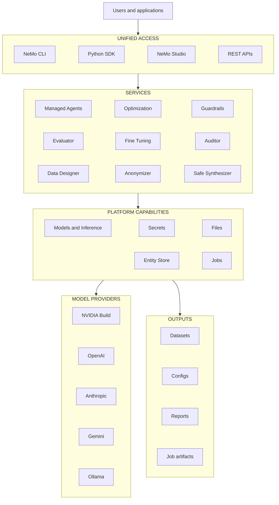

Make the agents you ship faster, more accurate, and safer.

NeMo Helix is an extensible Open Source agentic control plane to improve and harden agents and agentic software. It builds on the NeMo OSS Libraries like Evaluator, Guardrails, Data Designer, Automodel, and NeMo RL, exposing them as a cohesive set of interfaces locally or in Kubernetes. Everything is exposed programmatically through REST APIs, a CLI, and a Python SDK, which allows agents or other applications easy access. Helix also ships with NeMo Studio, a modern web UI for humans to monitor and orchestrate your system.

## Architecture

Helix extends the NeMo Libraries by introducing common infrastructure primitives that allow multi-agent systems to operate at scale. These are designed as interoperable and modular plugins for common operations like agent execution, sandboxing with OpenShell, file storage, secrets management, auth, model management, and inference middleware. Each of these ships with a sane default, but can be easily replaced with your infrastructure of choice.

## What You Can Do

- **Secure agents.** Guardrails (content safety, jailbreak detection, PII redaction), Auditor (red-teaming via garak), Anonymizer (PII handling for training data).
- **Evaluate agents.** LLM-as-judge, deterministic, agentic, and RAG benchmarks. [Harbor](https://www.harborframework.com/)-backed eval suites for regression testing.
- **Tune agents.** Skill optimization, prompt and hyperparameter tuning, Switchyard model routing.
- **Build agents.** Create platform-managed agents with agent.yaml, with legacy support for NAT-based LangGraph agents. Shared infrastructure: Inference Gateway, Secrets, Files, Entity Store, Jobs.
- **Run agents.** Deploy and manage agents interactively or as long-running jobs.
- **Generate synthetic data.** Generate synthetic data for training or evaluation purposes using Data Designer.
- **NeMo Studio (alpha).** Installed automatically with the platform. Studio is a browser UI for chatting with agents and models, starting and monitoring various jobs, and reviewing results. Studio's agent-focused features are still a work in progress; the CLI is the primary surface today.

## Platform Capabilities

The platform provides several shared capabilities to NeMo libraries.

- [Models and Inference](/documentation/models-and-inference) for model providers, virtual
  models, and gateway calls.
- [Files](/documentation/get-started/core-concepts/manage-files), [Secrets](/documentation/get-started/core-concepts/manage-secrets),
  [Entities](/documentation/get-started/core-concepts/entities), and jobs for storing state and
  running local work.

## Architecture Diagram

## Where to Go Next

- [Setup](/documentation/get-started) - install, configure providers, and run
  local services.
- [About Agents](/documentation/agents) - learn the managed agent lifecycle.
- [Optimize Agents](/documentation/agents/optimize-agents) - improve cost, quality, and model
  routing.
- [Add Guardrails to an Agent](/documentation/agents/add-guardrails) - route agent model traffic
  through input and output rails.
- [Scan Trace Data](/documentation/agents/scan-trace-data) - check agent traces for PII and leaked
  credentials.
