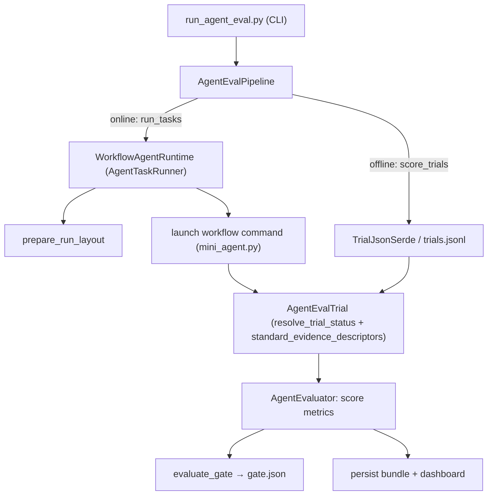

<!-- SPDX-FileCopyrightText: Copyright (c) 2025-2026 NVIDIA CORPORATION & AFFILIATES. All rights reserved. -->
<!-- SPDX-License-Identifier: Apache-2.0 -->

# run_agent_eval — workflow runtime over the trials API

A minimal, self-contained example that runs agent-eval tasks through a
**workflow runtime** and scores them with the trials-based
`nhx_evals_sdk.agent_eval` SDK, following the standard shape: load task →
run agent → score → gate, plus offline rescoring.

Its agent is a tiny bundled script (`mini_agent.py`), so it runs **end to end
with no external infrastructure**. See [Plugging in a real
workflow](#plugging-in-a-real-workflow) to drive your own agent.

## What it demonstrates

The SDK stays responsible for generating trials and scoring them; the example
owns the CI-policy glue (the pass/fail gate, the pipeline wrapper, and the run
layout). Components and the building blocks
they use (SDK unless noted *example-local*):

| Component | File | Role / building blocks |
|---|---|---|
| `WorkflowAgentRuntime` | `workflow_runtime.py` | `AgentTaskRunner` (toy host-subprocess agent): `resolve_trial_status`, `standard_evidence_descriptors` (SDK) + `prepare_run_layout` (example-local `layout.py`) |
| `TrialJsonSerde` | `workflow_runtime.py` | `AgentTrialSerde`: offline read/write of a stored `AgentEvalTrial` |
| Tasks + metrics | `workflow_runtime.py` | `AgentPhaseSuccessMetric`, `EvidencePresenceMetric`, a task-authored `OutputContainsMetric` |
| CLI harness | `run_agent_eval.py` | `AgentEvaluator` (SDK) via the example-local `AgentEvalPipeline` (`pipeline.py`) + gate (`gating.py`) |
| `mini_agent.py` | `mini_agent.py` | default agent — a dependency-free stand-in workflow |

## Run it

From the repository root:

```bash
# Online: run the workflow agent on every example task, score, and gate.
python -m packages.nhx_evals_sdk.examples.run_agent_eval.run_agent_eval --task all

# A single task.
python -m packages.nhx_evals_sdk.examples.run_agent_eval.run_agent_eval --task write-report

# List available tasks.
python -m packages.nhx_evals_sdk.examples.run_agent_eval.run_agent_eval --list-tasks
```

Each online run writes a bundle to `run-agent-eval-output/`
(`tasks.jsonl`, `trials.jsonl`, `scores.jsonl`, `summary.json`, `gate.json`,
`report.html`) plus per-task evidence under `evidence/workflow/<task>/`.

Example output:

```text
run_id: agent-eval-20260620195929
tasks: 2  trials: 2
  agent_phase_success.agent_phase_success: 2/2 true
  evidence_presence.evidence_present: 2/2 true
  output_contains.output_contains: 2/2 true
output_dir: .../run-agent-eval-output
gate: .../run-agent-eval-output/gate.json
```

> The metrics here emit booleans, which aggregate as `nan` in the numeric
> `summary.scores` view (that view is for range scores); the example summarizes
> them as a true-rate instead, and the gate reads `agent_phase_success` as the
> per-task pass signal.

### Offline rescoring (no agent execution)

Re-score already-captured trials through the same pipeline. Pass either a full
run bundle (reads `trials.jsonl`) or a single runtime run dir (reads
`trial.json` via `TrialJsonSerde`):

```bash
# Re-score an entire prior bundle.
python -m packages.nhx_evals_sdk.examples.run_agent_eval.run_agent_eval \
  --rescore-dir run-agent-eval-output --output-dir /tmp/rescore

# Re-score one captured run dir via the serde.
python -m packages.nhx_evals_sdk.examples.run_agent_eval.run_agent_eval \
  --rescore-dir run-agent-eval-output/evidence/workflow/write-report --output-dir /tmp/rescore-one
```

## Execution flow



## Plugging in a real workflow

`WorkflowAgentRuntime` launches `config.command` per task, substituting the
tokens `{instruction}`, `{workspace}`, and `{input_json}`. The default runs the
bundled `mini_agent.py`; supply your own command to drive a real agent:

```python
from packages.nhx_evals_sdk.examples.run_agent_eval.workflow_runtime import (
    WorkflowAgentRuntime,
    WorkflowRuntimeConfig,
)

runtime = WorkflowAgentRuntime(
    WorkflowRuntimeConfig(
        command=["nat", "run", "--config", "workflow.yml", "--input", "{instruction}"],
        agent_model="my-model",
    )
)
```

Any executable that reads the task input, writes results into `{workspace}`,
prints a final answer to stdout, and exits non-zero on failure works unchanged.

## Files

- `run_agent_eval.py` — CLI harness (online run + offline rescore + gate).
- `workflow_runtime.py` — toy runtime adapter, trial serde, example tasks, metric.
- `mini_agent.py` — dependency-free stand-in agent (the default toy workflow).
