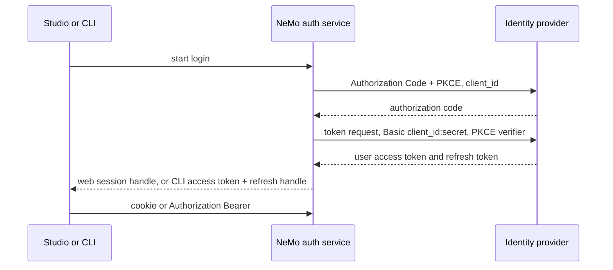

<!-- SPDX-FileCopyrightText: Copyright (c) 2025-2026 NVIDIA CORPORATION & AFFILIATES. All rights reserved. -->
<!-- SPDX-License-Identifier: Apache-2.0 -->

# Confidential OIDC Client for Studio and CLI

Last updated: 2026-10-02

## Goal

Let a deployment authenticate to its identity provider as one confidential
OAuth client, using Authorization Code with PKCE and `client_secret_basic`,
for both Studio and the CLI.

The client secret lives only on the NeMo auth service. Studio and the CLI
start login against NeMo. NeMo is the application the identity provider
knows about. Existing public-client deployments keep today's browser PKCE
and CLI device flows.

This is the flow for customers such as Siemens who register an Authorization
Code + PKCE application and require Client Secret Basic. Base the work on
`main`; any earlier Studio-only spike is reference material, not a prerequisite.

Operator documentation is part of the deliverable. The setup how-to includes
the login sequence diagram and the registration, secret, Studio, and CLI
steps. It ships in the same change as the feature.

## Current Behavior

On `main`, interactive login is a public client:

- Studio uses `react-oidc-context` with `client_id` and the issuer
  (`web/packages/studio/src/App.tsx`). The browser runs Authorization Code
  with PKCE and stores the user in `localStorage`. API calls attach
  `Authorization: Bearer` from that store.
- The CLI discovers `/apis/auth/discovery` and runs the device flow with
  `client_id` only (`packages/nemo_helix_ext/src/nemo_helix_ext/auth/device_flow.py`).
  Refresh uses the same public client id
  (`packages/nemo_helix_ext/src/nemo_helix_ext/auth/token_provider.py`).
- Discovery returns issuer, endpoints, and client ids. It has no client
  authentication method and no brokered login URL
  (`services/core/auth/src/nhx/core/auth/api/v2/discovery/endpoints.py`).
- `auth.oidc.introspection_client_secret_env_var` is a different credential.
  The API uses it for RFC 7662 introspection. It does not log Studio or the
  CLI in.

`client_secret_basic` on a browser or a published CLI is not viable. Anyone
who can read the page or the binary can read the secret. After that, the
identity provider is no longer authenticating a confidential client.

## Decision

NeMo holds the secret. Siemens, or any other provider, gets one confidential
app registration:

- Grant: Authorization Code with PKCE.
- Token endpoint authentication: `client_secret_basic`.
- Redirect URI: NeMo's callback, for example
  `https://<nemo-host>/apis/auth/v2/login/callback`.
- Secret: one value, mounted into the auth service from the cluster secret
  store. Users, the Studio bundle, and the `nemo` binary never receive it.

The CLI localhost port is a second hop between NeMo and the CLI. It is not
registered at the identity provider.

`client_secret_basic` requires a confidential process to authenticate token
endpoint requests, but it does not dictate where the issued tokens are stored.
Because neither browser JavaScript nor a distributed CLI can protect the
client secret, NeMo performs the code and refresh exchanges. This design then
uses server-side, account-bound `web_session` and `cli_refresh` credentials so
continued access can be revoked through the account lifecycle. Web clients
receive only an opaque session cookie; the CLI receives a provider access token
and an opaque NeMo refresh handle.

Default login is always the platform client, `auth.oidc.client_id`. That
client stays public unless the operator sets
`token_endpoint_auth_method: client_secret_basic` on it. A second public
client does not replace that default. On a deployment that configures both,
the platform client is the confidential one, so default login is
confidential, and the public client is only selected explicitly.



## Non-Goals

- Do not add a separate Studio-only `studio.confidential_oidc` or
  `VITE_AUTH_MODE` switch. Confidential login is selected by the shared OIDC
  client configuration.
- Do not put the client secret in discovery, the Studio bundle, Helm values,
  the CLI config file, or logs.
- Do not return the identity-provider access token, ID token, or refresh
  token to Studio JavaScript.
- Do not return the identity-provider refresh token to the CLI in
  confidential mode. The CLI receives an opaque NeMo refresh handle.
- Do not change public-client Studio PKCE or CLI device flow when
  `token_endpoint_auth_method` is `none`.
- Do not broadly refactor or simplify Studio authentication in this change.
  Keep its existing `react-oidc-context` structure and public-client behavior;
  add only the compatibility path required for confidential web sessions.
  Removing browser OIDC machinery or unifying all Studio authentication behind
  web sessions belongs in a follow-up PR.
- Do not embed a client secret in the CLI so it can call the identity
  provider directly.
- Do not broker the resource-owner password grant in this work. In
  confidential mode, `nemo auth login --username/--password` fails with an
  error that points at the browser login flow.
- Do not replace RFC 7662 introspection. Opaque access tokens continue to
  use the existing introspection client.

## Configuration

`client_id` alone cannot select Client Secret Basic. The introspection
secret cannot be reused for login. `OIDCConfig` in
`packages/nhx_common/src/nhx/common/config/base.py` needs three new fields.
The class already exists on `main`, so the change is additive. Existing
public-client config keeps working because the new method defaults to `none`.

Operator config:

```yaml
auth:
  enabled: true
  oidc:
    enabled: true
    issuer: "https://idp.example.com"
    client_id: "<confidential-client-id>"
    token_endpoint_auth_method: client_secret_basic
    client_secret_env_var: NHX_OIDC_CLIENT_SECRET
    session_encryption_key_env_var: NHX_AUTH_SESSION_ENCRYPTION_KEY
```

| Field | Values | Purpose |
| --- | --- | --- |
| `token_endpoint_auth_method` | `none` (default) or `client_secret_basic` | `none` keeps today's public Studio PKCE client and CLI device flow. `client_secret_basic` makes the auth service perform the identity-provider token request. |
| `client_secret_env_var` | environment variable name | Required when the method is `client_secret_basic`. The process environment holds the secret. Empty or unset fails closed at login time. |
| `session_encryption_key_env_var` | environment variable name | Required in confidential mode. Encrypts provider token payloads stored in account credential records and short-lived broker transaction records. |

`login_redirect_uri` is optional. When unset, derive the callback from the
request's external base URL plus `/apis/auth/v2/login/callback`.

Reject an inline `client_secret` or `session_encryption_key` the same way
`introspection_client_secret` is rejected today. The schema stores variable
names only.

These existing fields stay as they are:

- `issuer`, `client_id`, endpoint overrides, `default_scopes`, and
  `bearer_token_source`.
- `cli_client_id`. In public mode this remains the CLI's client id and
  defaults to `client_id`. In confidential mode the default CLI login uses
  the same confidential `client_id` as Studio, so `cli_client_id` stays
  unset unless a deployment intentionally gives the CLI a different
  confidential client.
- `public_client_id`. Optional extra public client. It is advertised when
  set and is never the default. The Authentik and ZITADEL demos set the
  platform `client_id` to `nemo-helix-user` and `public_client_id` to
  `nemo-helix-cli`. Deployments that only set the historical `client_id`
  keep that public client as the default.
- `introspection_client_id` and `introspection_client_secret_env_var`. That
  pair authenticates RFC 7662 introspection. It does not log users in.

`contrib/auth/manifest.schema.yaml` already allows `client_secret_basic` for
test-harness machine-client grants. Leave that schema alone. It does not
configure Studio or CLI login.

## User-login client versus setup client

Confidential only describes how an application authenticates. The reference
providers already have confidential applications that are not user login.
Those stay, and the user-login application is a new one. Do not point
`auth.oidc.client_id` or `client_secret_env_var` at a setup, workload, or
introspection client when enabling user login.

| Role | Authentik | ZITADEL | Grant | Used for |
| --- | --- | --- | --- | --- |
| Setup client | `nemo-helix`, secret `nemo-helix-secret-dev`, manifest key `e2e_setup_password_grant` | Machine user in `e2e_setup_grant`, secret `ZITADEL_E2E_SETUP_CLIENT_SECRET` | Password or client credentials | Contract-test setup principal. Creates workspaces and role grants. |
| Introspection client | None as a separate interactive app | `nemo-helix-api`, secret `NHX_AUTH_OIDC_INTROSPECTION_CLIENT_SECRET` | API / RFC 7662 | Resource server validating opaque tokens. |
| Public user client | `nemo-helix-cli` | `nemo-helix-cli` (`OIDC_APP_TYPE_NATIVE`) | Device code | Public device flow. Configured as `auth.oidc.public_client_id` on the same deployment as the confidential user client. |
| User-login confidential client | New provider `nemo-helix-user`, client id `nemo-helix-user` | New OIDC app `nemo-helix-user` (`OIDC_APP_TYPE_WEB`) | Authorization code + refresh, with PKCE and `client_secret_basic` | Server-side web session used by Studio and CLI brokered login. |

Rules for the user-login client:

- Its own client id and its own secret. The Authentik demo secret must not
  be `nemo-helix-secret-dev`. The ZITADEL demo secret must be a different
  key from `setup_client_secret` and `nemo_client_secret`.
- Redirect URI is only the NeMo user-login callback. The setup clients keep
  an empty redirect list and no authorization-code grant for users.
- Tests that complete user login assert the token request's client id is
  `nemo-helix-user`. A test that only succeeds with the setup client id is
  covering the wrong application.
- `NHX_OIDC_CLIENT_SECRET` is the platform env var for this user-login
  secret. Setup and introspection keep the env vars they already use.

Helm does not enumerate `auth.oidc` field by field. Document the variable
names in the config reference. Secret values are created in the cluster
secret store and exposed to the auth service pod. They are not written into
`k8s/helm/values.yaml`.

### Discovery response

Discovery advertises the user-login clients that are configured. It does
not invent a confidential client, and it does not advertise a public client
that was not set. The secret and the secret env var names stay out of the
response.

The platform client is always present and is the default:

```json
{
  "client_id": "nemo-helix-cli",
  "token_endpoint_auth_method": "none",
  "clients": [
    {
      "name": "platform",
      "client_id": "nemo-helix-cli",
      "token_endpoint_auth_method": "none",
      "default": true
    }
  ]
}
```

When the platform client is confidential and a public client is also
configured, discovery lists both. `default` stays on `platform`:

```json
{
  "client_id": "nemo-helix-user",
  "token_endpoint_auth_method": "client_secret_basic",
  "public_client_id": "nemo-helix-cli",
  "login_url": "https://<nemo-host>/apis/auth/v2/login",
  "cli_login_url": "https://<nemo-host>/apis/auth/v2/cli/login",
  "clients": [
    {
      "name": "platform",
      "client_id": "nemo-helix-user",
      "token_endpoint_auth_method": "client_secret_basic",
      "default": true
    },
    {
      "name": "public",
      "client_id": "nemo-helix-cli",
      "token_endpoint_auth_method": "none",
      "default": false
    }
  ]
}
```

`login_url` and `cli_login_url` are included when the platform client's
method is `client_secret_basic`. Update `OIDCDiscoveryResponse` and the
parsers in `packages/nemo_helix_ext/src/nemo_helix_ext/auth/helpers.py` and
`packages/nemo_helix_plugin/src/nemo_helix_plugin/client/oidc.py` together.

## Account Credential Store

The identity provider proves who the user is and issues provider tokens. It
does not own NeMo's runtime session lifecycle. After a successful login, NeMo
resolves or materializes the local account from the provider issuer and subject
through `accounts` and `account_identities`, then creates account-bound
credential records for continued access.

Add a concrete `account_credentials` store beside `accounts` and
`account_identities`. The auth service owns credential semantics through a
typed repository or client, but durable credential storage lives with account
state so account-level revocation can query it directly. It uses the same
lifecycle idea as access keys, but does not overload `AccessKeyEntity`;
access-key fields such as
`entity_type=USER|SERVICE_ACCOUNT`, rotation metadata, and subject-principal
validation are specific to access keys.

Minimum record shape:

| Field | Purpose |
| --- | --- |
| `id` | Stable credential id, generated server-side. |
| `owner_account_id` | Account that owns or can manage the credential. |
| `subject_account_id` | Account the credential authenticates as. Defaults to `owner_account_id` for user sessions and personal keys. Service-bound access keys use the creator or admin as owner and the service account as subject. |
| `account_identity_id` | Optional identity binding used at login time. |
| `credential_type` | Initially `access_key`, `web_session`, and `cli_refresh`. Short-lived CLI handoff codes can also use this store after callback because the account is then known. |
| `lookup_hash` | Hash of the presented secret or handle: access-key `jti`, session id, CLI refresh handle, or CLI one-time code. Raw values are never persisted. |
| `status` | `ACTIVE`, `REVOKED`, `SUSPENDED`, and access-key rotation states as needed. |
| `issued_at`, `expires_at`, `last_used_at`, `revoked_at`, `revoked_by` | Common lifecycle and audit fields. |
| `public_metadata` | Non-secret display data such as key name, description, issuer, audiences, scopes, and client type. |
| `encrypted_payload` | Type-specific secret material, such as provider refresh tokens or cached provider access tokens. |

Every credential lookup fails closed unless the credential is active, unexpired,
and its owner account, subject account, and login identity are active as
applicable. For new credential types, a missing account credential row means
inactive. The only exception is the temporary access-key compatibility fallback
described below. Revoking or suspending an account can invalidate all active
rows where that account is the owner or subject in one place.

Pre-auth login transactions are different. The initial `state`, PKCE verifier,
and return target exist before NeMo knows the account, so they stay in a
short-TTL broker transaction table. Once the callback succeeds and the account
is resolved, any durable session, CLI refresh grant, or CLI handoff credential
moves into `account_credentials`, and the pre-auth transaction is consumed.

Access keys move to the same account credential store without a bulk migration:

- All newly created access keys write `credential_type=access_key` records in
  the new store.
- Access-key authentication validates the signed token as it does today, then
  checks the new store first by `jti` hash. If no new record exists, it falls
  back to the deprecated `AccessKeyEntity` lifecycle record for existing keys.
- List, revoke, suspend, unsuspend, and status operations span both stores
  during the deprecation window and label legacy records so callers can see
  which path a key uses.
- Account-wide revocation is exact for `account_credentials`. During the
  deprecation window, also revoke matching legacy `AccessKeyEntity` rows by
  known principal or subject aliases where possible. Individual legacy key
  revocation remains supported; the strict all-credential account guarantee
  applies after new writes move to the new store and old rows age out.
- Rotating a legacy key mints the successor into `account_credentials` and
  transitions the old legacy record through the existing rotation or revoke
  path.
- No newly created access key writes to `AccessKeyEntity`. Existing legacy rows
  age out by expiry. A future cleanup removes the fallback and deprecated
  entity.

For web clients such as Studio, this gives full control over the session
because the browser only has an opaque cookie handle. For the CLI, this plan
stores an opaque NeMo refresh handle on the client, not the provider refresh
token. Revoking the `cli_refresh` credential stops future refresh immediately.
A provider access token already returned to the CLI may remain usable until its
expiry unless the provider revokes it or NeMo switches to issuing its own
short-lived user access tokens.

## Login Flows

### Shared token exchange

The auth service owns the identity-provider token call:

1. Create `state` and a PKCE verifier. Persist the pre-auth transaction in
   the auth database with a short TTL. Store the verifier encrypted.
2. Redirect the browser to the provider authorization endpoint with
   `response_type=code`, `client_id`, `redirect_uri`, `scope`, `state`,
   `code_challenge`, and `code_challenge_method=S256`.
3. On callback, require a matching single-use `state`. Exchange the code
   with `client_secret_basic` and `code_verifier`.
4. Resolve or materialize the account from the provider issuer and subject.
5. Create account credential records for the flow: a `web_session`,
   `cli_refresh`, or post-callback `cli_login_code` as appropriate. Store
   provider token material only in encrypted server payloads and store hashes
   for every client-presented handle.
6. Encode the Basic credential per RFC 6749 section 2.3.1: form-urlencode
   the client id and secret, then base64-encode `client_id:client_secret`.

Use the auth service database so multiple replicas share the transaction.
Process memory is not a session store.

### Web session (Studio)

When the method is `client_secret_basic`:

1. Studio sends the browser to `GET /apis/auth/v2/login`.
2. After the callback, the auth service sets an HTTP-only session cookie
   containing an opaque session handle and redirects to a relative Studio
   path.
3. The cookie is `Secure`, `HttpOnly`, `SameSite=Lax`, and `Path=/`.
4. Studio calls APIs with `credentials: 'include'` and no bearer token from
   `localStorage`.
5. `AuthorizationMiddleware` in
   `packages/nhx_common/src/nhx/common/auth/middleware.py`, when no Bearer
   header is present, resolves that cookie through the auth service and
   requires an active `web_session` credential, active account, and active
   account identity. The provider token is not copied into the browser.
6. Cookie-authenticated `POST`, `PUT`, `PATCH`, and `DELETE` require a
   custom request header that Studio sends and a cross-site form cannot
   set. Bearer authentication is unchanged.
7. API authorization uses the account-bound NeMo session metadata. It does
   not require a provider access token on each request.
8. Logout clears the cookie and revokes or deletes the `web_session`
   credential. Provider-wide single sign-out is outside this change.

Keep the existing SPA authentication structure intact. Public mode continues
to use `react-oidc-context` exactly as it does on `main`. Confidential mode adds
a narrow compatibility path behind the existing login, profile, token-status,
logout, and request-transport entry points: it redirects to the cookie login,
reads web-session state from NeMo, and sends cookies instead of browser-held
bearer tokens. Change individual callers only where they cannot already use the
shared request transport. No endpoint returns a provider token to the page.

### CLI

`nemo auth login` with no client flag uses the discovery client whose
`default` is true. That is the platform client. Studio does the same and
has no client switch.

When that default client uses `client_secret_basic`:

1. `nemo auth login` opens a browser, or with `--no-browser` prints a URL
   and waits.
2. The CLI listens on `127.0.0.1` with an ephemeral port.
3. The browser completes login at NeMo. NeMo redirects only to
   `http://127.0.0.1:<port>/callback` or `http://localhost:<port>/callback`
   with a single-use code. Any other redirect target is rejected.
4. The CLI posts that code to NeMo and receives the user access token, an
   opaque NeMo refresh handle, and expiry. It stores them in the existing
   context token file and sends `Authorization: Bearer` as it does now. For
   compatibility the stored field can remain named `refresh_token`, but the
   value is not the provider refresh token in confidential mode.
5. Refresh calls NeMo, not the identity provider. NeMo looks up the active
   `cli_refresh` account credential, checks the account and identity status,
   performs the provider refresh grant with `client_secret_basic`, rotates the
   encrypted provider refresh token or client handle when needed, and returns
   the new access token and refresh handle.

`--oidc-client` is a hidden Typer option. It is omitted from `nemo auth
login --help` and from the user-facing docs. Tests pass `--oidc-client
public` to select the advertised public client. Omitting it, or passing
`--oidc-client platform`, selects the platform client. The command fails
when the name is not in the discovery `clients` list.

When the platform client is public, omitting the flag keeps today's device
flow. The hidden flag is how the Authentik and ZITADEL suites reach
`nemo-helix-cli` after the platform client has been switched to
`nemo-helix-user`.

Revoking the CLI refresh credential prevents future refresh immediately. The
already-issued provider access token remains bounded by its provider expiry. If
instant revocation of those bearer tokens becomes a requirement, add a separate
NeMo-issued short-lived user access token or a middleware account-status check
in a later phase.

## API Surface

`main` has public-client discovery but no server-side login broker. The
confidential token request is not itself a new inbound route: the auth service
posts to the identity provider's existing token endpoint from the callback or
refresh handler. The minimum browser broker needs a start route to create the
server-side state and PKCE transaction and a callback route registered at the
identity provider. The other routes support NeMo-owned sessions and CLI login;
they are not requirements of `client_secret_basic` itself.

Add these routes on the auth service, under the existing v2 router:

| Method and path | Purpose | Result |
| --- | --- | --- |
| `GET /apis/auth/v2/login` | Browser broker | Create the Studio transaction and redirect to the identity provider |
| `GET /apis/auth/v2/login/callback` | Browser broker | Validate the single-use state, perform the confidential code exchange, and complete the Studio or CLI login |
| `POST /apis/auth/v2/logout` | Web-session lifecycle | Revoke the web session used by Studio and clear its cookie |
| `GET /apis/auth/v2/session` | Web-session authentication | Resolve the opaque web-session cookie to validated principal inputs for API middleware |
| `POST /apis/auth/v2/cli/login` | Brokered CLI login | Validate the loopback URI, create the CLI transaction, and return a browser URL and login id |
| `GET /apis/auth/v2/cli/login/{id}` | Brokered CLI login | Continue the stored transaction and redirect the browser to the identity provider |
| `POST /apis/auth/v2/cli/token` | Brokered CLI handoff and refresh | Exchange a single-use NeMo code or opaque NeMo refresh handle |

The separate CLI browser-continuation route is a packaging choice, not an
OAuth requirement. It keeps identity-provider authorization URL construction
inside NeMo and may be folded into the `POST /cli/login` response if that
simplifies the implementation without exposing secrets or server-held state.

Names can move to match existing router layout. Behavior above is the
contract. `/apis/auth/discovery` gains the configured-client list from
Discovery response above: the platform client, and the public client only
when `public_client_id` is set.

Update the discovery parsers together:

- `services/core/auth/src/nhx/core/auth/api/v2/discovery/endpoints.py`
- `packages/nemo_helix_ext/src/nemo_helix_ext/auth/helpers.py`
- `packages/nemo_helix_plugin/src/nemo_helix_plugin/client/oidc.py`

Run `make refresh-openapi` when the routes land.

## Phases

### Phase 1: Config and discovery

Implement the `OIDCConfig` and `OIDCDiscoveryResponse` additions in
Configuration above. Start from `main`.

- Add the three config fields, optional `login_redirect_uri`, and the
  inline-secret rejection.
- Publish `token_endpoint_auth_method`, `login_url`, and `cli_login_url`
  from discovery.
- Parse the new discovery fields in both the CLI and plugin clients.
- Tests: default remains `none`; inline `client_secret` and
  `session_encryption_key` are rejected; discovery JSON contains the method
  and URLs and contains neither the secret nor either env var name.

Exit: a deployment can advertise confidential mode before the credential
store and login routes exist. This phase does not enable the method in any
live environment.

### Phase 2: Account credential store and access-key cutover

- Add the concrete `account_credentials` store from Account Credential Store.
  Store handles and access-key identifiers as hashes; store provider token
  payloads encrypted; keep lifecycle and audit fields common across types.
- Resolve or materialize accounts through the existing account identity path
  before creating any durable session, refresh, or access-key credential.
- Add account-level credential queries and lifecycle operations so account
  suspension, account revocation, and explicit credential revocation can make
  matching credentials inactive.
- Move new access-key issuance to `credential_type=access_key` records in
  `account_credentials`.
- Update access-key authentication to check the new store first, then fall
  back to the deprecated `AccessKeyEntity` record for existing unexpired
  keys.
- Update access-key list, status, revoke, suspend, unsuspend, and rotate
  operations to work across both stores during the deprecation window. Mark
  legacy records in responses if the response model can carry it without
  breaking clients; otherwise keep the compatibility detail internal.
- Do not run a bulk migration. Do not write newly created keys to
  `AccessKeyEntity`. Legacy keys naturally age out by expiry, then a future
  cleanup removes the fallback and deprecated entity.
- Tests: new access keys write only to the new store; validation accepts a
  new key; validation accepts an existing legacy key; revoke and suspend work
  for both stores; rotating a legacy key writes the successor to the new
  store; account suspension or revocation disables new-store credentials;
  expired legacy keys are rejected by the fallback.

Exit: all new credentials have account-bound lifecycle records, existing
access keys remain usable and revocable until they expire, and NeMo has the
revocation substrate needed for brokered sessions.

### Phase 3: Auth-service broker

- Persist only pre-auth login transactions in the short-TTL broker table.
  After callback, create `web_session`, `cli_refresh`, and post-callback
  `cli_login_code` account credentials as needed.
- Encrypt provider tokens at rest in account credential payloads. Hash
  single-use codes, session ids, refresh handles, and access-key identifiers
  before lookup.
- Implement the Studio login, callback, and logout routes.
- Implement the token exchange, including RFC 6749 Basic encoding and PKCE
  S256.
- Fail closed when the secret or encryption key is missing, when `state`
  does not match, when the account or identity is inactive, or when the
  provider token call fails. Do not include provider response bodies in
  client errors or logs.
- Tests: consumed `state` cannot be reused; missing credential row rejects a
  session or refresh; provider tokens are encrypted at rest; inactive account
  and inactive identity reject the session; no route returns the provider
  refresh token to Studio or the CLI.

Exit: a browser can complete Siemens-style login against the auth service,
receive only an opaque session cookie, and create revocable account-backed
session state.

### Phase 4: CLI

- `nemo auth login` follows the discovery default, which is the platform
  client. Add hidden `--oidc-client` for `platform` and `public`.
- Implement the localhost handoff and NeMo refresh for a confidential
  platform client.
- Keep the current token file shape, but in confidential mode store an opaque
  NeMo refresh handle in the existing refresh-token field.
- Tests: the flag is absent from `--help`; an unknown client name fails; a
  public client that discovery did not advertise fails; redirect targets
  other than loopback are rejected; the CLI token request never sends the
  client secret; refresh goes to NeMo; a revoked `cli_refresh` credential
  fails refresh; a platform client with method `none` still uses device
  flow; password grant on a confidential platform client returns the
  documented error.

Exit: `nemo auth login` works against a confidential deployment without a
secret or provider refresh token on the machine.

### Phase 5: Web session and Studio integration

- Preserve the existing `react-oidc-context` provider, hooks, callback route,
  and bearer-token behavior for public mode.
- Add the smallest conditional web-session path to the existing Studio auth
  entry points. Confidential mode redirects to `/apis/auth/v2/login`, reads
  profile and authenticated state from NeMo, posts to the NeMo logout route,
  and sends the session cookie.
- Teach `AuthorizationMiddleware` to resolve that cookie and to require the
  CSRF header on cookie-authenticated mutations.
- Configure the shared generated request transport for cookies and the CSRF
  header in confidential mode. Touch hand-written assistant, chat, live
  evaluation, worker, download, and plugin paths only as required to operate
  without a browser-held bearer token; do not reorganize them in this PR.
- Tests: the page never receives the provider token; a cookie session can
  call an API; a cross-site mutation without the CSRF header is rejected;
  login, profile, and logout work through the compatibility path; revoked
  `web_session` credentials are rejected; inactive accounts and identities
  are rejected; existing public-mode Bearer calls still succeed.

Exit: Studio on a confidential deployment no longer runs the public PKCE
client, web-session revocation is controlled by the account credential store,
and public-client Studio behavior remains unchanged. Broader Studio auth
simplification is deferred to a follow-up PR.

### Phase 6: Operator docs

Write the setup guide in the same change as the feature. The current OIDC
page (`docs/auth/authentication/oidc.mdx`) tells operators to register a
public client and enable device flow. Confidential clients need their own
how-to, and that page needs a pointer to it.

Add `docs/auth/authentication/confidential-client.mdx` and list it in
`docs/fern/versions/latest.yml` immediately after OIDC Setup, under Access
Control → Authentication. Title: "Confidential Clients". Link it from:

- `docs/auth/authentication/oidc.mdx`, in the prerequisites and in Flows
  Supported, so an operator who must use a client secret does not follow
  the public device-flow steps.
- `docs/auth/authentication/index.mdx`, in Connect Your Identity Provider.
- `docs/auth/troubleshooting.mdx`, next to the existing device-flow and
  client-id mismatches.
- `docs/auth/deployment/hardening.mdx`, next to the existing client-secret
  rotation item.

The page is a how-to. Put the login diagram directly under the opening
paragraph, before the steps. The redirect URI and the secret location are
hard to get right without that picture. Keep field-by-field definitions in
the generated config reference, and link to it.

Use this diagram in the doc:


The how-to then covers:

1. Register one confidential application at the identity provider.
   Authorization Code with PKCE, token endpoint auth `client_secret_basic`.
   The only redirect URI is NeMo's callback,
   `https://<nemo-host>/apis/auth/v2/login/callback`. The CLI loopback
   address is not registered at the provider.
2. Store the client secret and the session encryption key in the cluster
   secret store. Configure only the environment variable names:

   ```yaml
   auth:
     enabled: true
     oidc:
       enabled: true
       issuer: "https://idp.example.com"
       client_id: "<confidential-client-id>"
       token_endpoint_auth_method: client_secret_basic
       client_secret_env_var: NHX_OIDC_CLIENT_SECRET
       session_encryption_key_env_var: NHX_AUTH_SESSION_ENCRYPTION_KEY
   ```

3. State that the secret is mounted into the auth service pod and is never
   placed in Helm values, the Studio bundle, discovery, or the CLI config.
   Provider refresh tokens stay server-side in encrypted account credential
   records.
4. Sign in. Studio redirects through NeMo and keeps an HTTP-only session
   cookie. `nemo auth login` opens a browser to NeMo, receives the user
   access token and an opaque refresh handle on `127.0.0.1`, and refreshes
   through NeMo. Password grant is unavailable in this mode.
5. Verify: Studio can call an API, `nemo auth login` succeeds on a machine
   that does not have the client secret, and `/apis/auth/discovery` does
   not contain the secret.

Troubleshooting on the same page:

- Provider error `invalid_client`: the secret env var is missing, empty, or
  not the secret for `client_id`.
- Redirect URI mismatch: the provider must redirect to NeMo, not to
  `localhost` and not to `/studio`.
- CLI still attempting device flow: `token_endpoint_auth_method` is still
  `none`, or discovery was cached from before the config change.

Regenerate `docs/set-up/config-reference.mdx` with
`make generate-config-reference-docs` after the config fields exist. Update
`nemo auth login` help so the generated CLI reference describes brokered
login, then run `make generate-cli-reference-docs`. Run `make docs-check`
after the new page is in the nav.

Exit: an operator can register the provider app, mount the secret, and sign
in with Studio and the CLI by following the doc, with the sequence diagram
visible on that page.

### Phase 7: Authentik and ZITADEL coverage

Exercise both user-facing clients on one Authentik deployment and one
ZITADEL deployment. A deployment already has several OAuth clients
(`client_id`, `cli_client_id`, `workload_client_id`,
`introspection_client_id`). Add the confidential user client beside the
existing public client. Do not stand up a second platform to reach the
second client.

The same NeMo config names both user clients:

```yaml
auth:
  oidc:
    client_id: nemo-helix-user
    token_endpoint_auth_method: client_secret_basic
    client_secret_env_var: NHX_OIDC_CLIENT_SECRET
    session_encryption_key_env_var: NHX_AUTH_SESSION_ENCRYPTION_KEY
    public_client_id: nemo-helix-cli
```

Default Studio login and `nemo auth login` use the platform client,
`nemo-helix-user`. Discovery marks that client `default: true` and also
lists `nemo-helix-cli` because `public_client_id` is set. Device-flow tests
call `nemo auth login --oidc-client public`. They do not change the
platform default.

| Client | How a test selects it | Tests that must pass on that same deployment |
| --- | --- | --- |
| `nemo-helix-user` | `nemo auth login` | Brokered Studio login, brokered CLI login, and CLI refresh through NeMo. |
| `nemo-helix-cli` | `nemo auth login --oidc-client public` | Device-code issue, public CLI login, and public CLI refresh. |

API checks that only need a user bearer token, such as workspace RBAC, pass
with a token from either client. The setup client and the introspection
client still do not count as either user client.

Keep the setup, introspection, and public user clients listed above
unchanged. Add only the `nemo-helix-user` application from that table.

Authentik: add provider `nemo-helix-user` to
`contrib/auth/authentik/helm/files/blueprints/nemo.yaml` and the compose
seed. `client_type: confidential`, client id `nemo-helix-user`, grant types
`authorization_code` and `refresh_token`, and the NeMo callback as its only
redirect URI. Leave `nemo-helix` on the e2e password grant with its current
secret and empty redirect list.

ZITADEL: add `nemo-helix-user` in
`contrib/auth/zitadel/helm/templates/seed-job.yaml` as `OIDC_APP_TYPE_WEB`
with authorization code, refresh, and `client_secret_basic`. Store its
secret under a new state key, `user_login_client_secret`, separate from
`setup_client_secret` and `nemo_client_secret`. Leave `nemo-helix-cli` as
the native device app and `nemo-helix-api` as the introspection app.

On the existing Authentik and ZITADEL runtimes, set both clients:

```yaml
auth:
  oidc:
    client_id: nemo-helix-user
    token_endpoint_auth_method: client_secret_basic
    client_secret_env_var: NHX_OIDC_CLIENT_SECRET
    session_encryption_key_env_var: NHX_AUTH_SESSION_ENCRYPTION_KEY
    public_client_id: nemo-helix-cli
```

Mount the user-login secret from the demo secret store. Do not write the
secret value into the values file. Add capability `confidential_oidc` next
to the existing `device_flow` capability on those runtimes. `device_flow`
tests select the public client with the hidden flag. `confidential_oidc`
tests use the default platform client.

Contract tests live under `tests/auth_idp/contracts/` and skip unless the
runtime has `confidential_oidc`. Cover both providers with the same tests:

- Discovery reports `token_endpoint_auth_method=client_secret_basic`,
  `login_url`, and `cli_login_url`, and the body contains neither the
  client secret nor `client_secret_env_var`.
- `GET /apis/auth/v2/login` redirects to the provider with `client_id`,
  `code_challenge_method=S256`, and no `client_secret` in the query.
- Completing the provider login yields a web-session cookie for Studio and does
  not return the provider access token, ID token, or refresh token to the
  client. Follow the provider login with the existing Authentik flow
  executor helper and a ZITADEL session helper, the same way
  `tests/auth_idp/device_flow.py` completes device login without a browser.
- The provider token endpoint receives `Authorization: Basic`. Assert this
  from the auth service's outgoing request in a focused test, and assert
  on the live providers that a wrong secret fails closed and the configured
  secret succeeds.
- `nemo auth login` stores a user access token and opaque refresh handle. A
  later refresh is sent to NeMo, and the CLI process never has
  `NHX_OIDC_CLIENT_SECRET` or the provider refresh token.

Static tests, run without a cluster:

- The Authentik blueprint contains `nemo-helix-user` with
  `client_type: confidential` and a NeMo callback redirect, and
  `nemo-helix` is still the setup provider with an empty redirect list.
- The user-login contract reads `client_id=nemo-helix-user` from discovery
  and does not read `e2e_setup_password_grant.client_id` or
  `e2e_setup_grant.client_id`.
- The ZITADEL seed creates the web app with basic client authentication
  and does not remove the native device app.
- Confidential Helm values name the secret env vars and do not inline the
  secret.
- Manifest capabilities list both `device_flow` and `confidential_oidc` on
  the Authentik and ZITADEL runtimes that register both user clients.

Exit: `pytest tests/auth_idp/static` passes. On one Authentik deployment
and one ZITADEL deployment, the `device_flow` tests pass against
`nemo-helix-cli` and the `confidential_oidc` tests pass against
`nemo-helix-user`. Shared bearer-token API contracts pass with a token
from either client.

## Verification

Targeted checks per phase:

- `uv run --frozen pytest` on the auth service tests, `nhx_common` auth
  tests, and the CLI auth tests touched in that phase.
- Account credential repository tests for lookup hashing, encrypted payloads,
  account and identity status checks, account-wide revocation, and legacy
  access-key fallback.
- `uv run --frozen ruff check` and `uv run --frozen ty check` on the touched
  packages.
- Studio unit tests for the confidential web-session compatibility path, from `web/` with
  `pnpm --filter nemo-studio-ui test` on the touched files.
- `make refresh-openapi` after the routes are added.
- `make generate-config-reference-docs` and `make generate-cli-reference-docs`
  after the config fields and CLI help text exist.
- `make docs-check` after the confidential-client page is linked from the
  Fern nav.
- `uv run --frozen pytest tests/auth_idp/static` after the Authentik and
  ZITADEL fixtures change.
- Authentik and ZITADEL `confidential_oidc` contract tests when those
  runtimes are available. Static coverage is required even when the live
  clusters are not.

A live Siemens check is operator validation, not a unit test: confirm the
provider token request carries `Authorization: Basic`, the secret is absent
from the browser and from `nemo auth` config, Studio API calls succeed with
the cookie, and CLI refresh succeeds after the access token expires.

## Relationship to Other Plans

Pre-created deployment key material and Kubernetes Secret ownership are
tracked separately in
`plans/2026-10-02-auth-provider-precreated-key-secrets-plan.md`.

Public clients remain the default for providers that issue tokens directly to
Studio and the CLI. Confidential mode is an additional deployment setting for
providers that require `client_secret_basic`.
