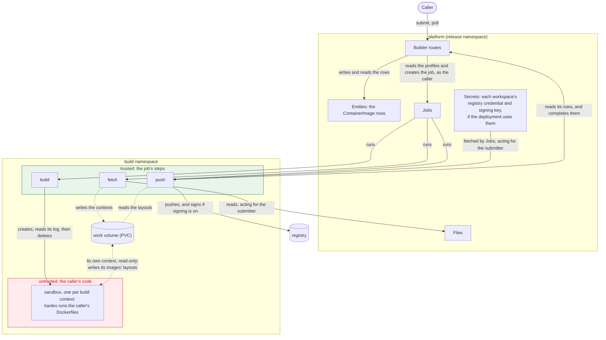
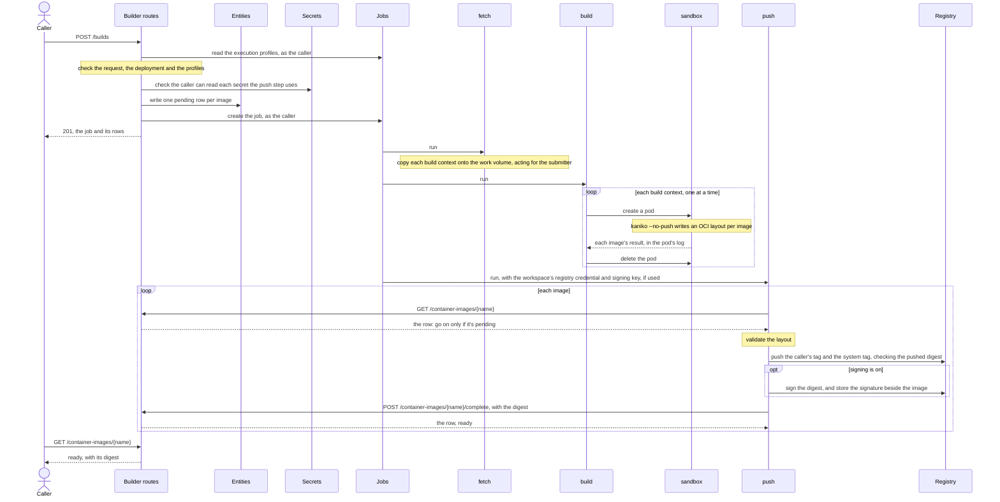

<!-- SPDX-FileCopyrightText: Copyright (c) 2025-2026 NVIDIA CORPORATION & AFFILIATES. All rights reserved. -->
<!-- SPDX-License-Identifier: Apache-2.0 -->

# NeMo Builder Plugin

Container image builds for NeMo Helix. You submit Dockerfiles whose build context is in a Files
fileset. The plugin builds them with kaniko, in a sandbox pod that holds no credentials. Then it
pushes each image to the deployment's registry, signs it with your workspace's key, and records it
as a `ContainerImage` you can pin by digest.

**Status: proof of concept.** It runs end to end, installed with the platform's Helm chart, on minikube
and on a shared multi-node cluster publishing to Harbor, and it has the [limitations](#limitations)
listed below.

## Quickstart (minikube)

This installs the platform with the builder, and a registry, inside minikube, from the platform's Helm
chart. It builds one image and checks the result. Run the commands from the repository root, in one
shell: later steps use variables that earlier ones set.

You need Docker with buildx, minikube, `kubectl`, `helm`, `openssl`, `jq`, and the `nemo` CLI
(`make bootstrap`; see [SETUP.md](../../SETUP.md)). The cluster uses 4 CPUs and 6 GB of memory.
Sandboxes resolve names with `8.8.8.8` and `1.1.1.1`, so your network must allow DNS to them; some
corporate networks and VPNs don't.

**1. Cluster.**

```bash
minikube start --driver=docker --cpus=4 --memory=6144
```

**2. Images.** Build the platform image, `nhx-api`, which includes the builder; `nhx-builder-tasks`, the
image the build steps run in; and `nhx-kaniko`, the sandbox's. On an x86 machine, use `linux/amd64`
instead of `linux/arm64`.

```bash
# The Studio UI is stubbed out; the builder doesn't use it
mkdir -p /tmp/empty-studio/artifacts && touch /tmp/empty-studio/artifacts/.keep
docker buildx bake -f docker-bake.hcl nhx-api-docker nhx-builder-tasks-docker nhx-kaniko-docker --load \
  --allow=fs.read=/tmp/empty-studio --set '*.platform=linux/arm64' \
  --set nhx-api-docker.contexts.nhx-studio-ui=/tmp/empty-studio

minikube image load my-registry/nhx-api:local
minikube image load my-registry/nhx-builder-tasks:local
minikube image load my-registry/nhx-kaniko:local
```

They're tagged `my-registry/<name>:local`, which step 4's values point the platform at.

`minikube image load` doesn't reliably replace an image already loaded under the same tag. When you
rebuild, give all three a new tag with `BAKE_TAG=<tag> docker buildx bake …`, then pass it to
`helm upgrade` as `--set api.image.tag=<tag>,core.image.tag=<tag>,platformConfig.platform.image_tag=<tag>`.

**3. Keys and a password.** All for this cluster only, kept in a temporary directory rather than the
repository: a signing key pair, and a password for the registry. Keep `$KEYS/signing.pub` to verify
signatures later.

```bash
KEYS=$(mktemp -d)
openssl ecparam -name prime256v1 -genkey -noout | openssl pkcs8 -topk8 -nocrypt -out "$KEYS/signing.key"
openssl pkey -in "$KEYS/signing.key" -pubout -out "$KEYS/signing.pub"
printf '%s' "$(openssl rand -hex 16)" > "$KEYS/registry-password"
```

**4. Install.** `config/minikube-values.yaml` installs the platform with only the services the builder
uses, and turns on the chart's `builder` section:

| Namespace | What runs there |
|---|---|
| `nhx-platform` | The platform, its database, and a registry at `nemo-helix-builder-registry.nhx-platform.svc.cluster.local:5000` that takes a username and password |
| `nhx-platform-builds` | The build jobs and their sandboxes, with the step ServiceAccounts, their RBAC, the work volume, and the namespace's limits |

```bash
helm install nemo-helix k8s/helm --namespace nhx-platform --create-namespace \
  -f plugins/nemo-builder/config/minikube-values.yaml \
  --set-file builder.devRegistry.password="$KEYS/registry-password" --wait --timeout 15m

kubectl -n nhx-platform port-forward svc/nemo-helix-api 8080:8080 >/dev/null &
export NHX_BASE_URL=http://localhost:8080
```

The port-forward runs in the background until the shell exits.

**5. Your workspace's secrets.** The push step logs in to the registry, and signs, with three
platform secrets in the workspace that submits the build:

```bash
nemo secrets create builder-registry-username --workspace default --value builder
nemo secrets create builder-registry-password --workspace default --from-file "$KEYS/registry-password"
nemo secrets create builder-signing-key --workspace default --from-file "$KEYS/signing.key"
```

**6. Build context.**

```bash
CTX=$(mktemp -d) && cat > "$CTX/Dockerfile" <<'EOF'
FROM docker.io/library/python:3.13-slim
RUN pip install --no-cache-dir six==1.16.0
RUN echo "hello from nemo-builder" > /hello.txt
EOF
nemo files filesets create hello-context --workspace default
nemo files upload "$CTX/" hello-context --workspace default
```

**7. Build.** A spec's `platform` defaults to `linux/amd64`. On an arm64 machine, its `RUN` steps
work only if the node can run amd64 binaries, as Docker Desktop's emulation does; otherwise add
`"platform": "linux/arm64"` to the spec.

```bash
curl -s -X POST "$NHX_BASE_URL/apis/builder/v2/workspaces/default/builds" \
  -H 'Content-Type: application/json' \
  -d '{
    "name": "hello",
    "revision": 1,
    "build_specs": [
      {
        "source": {"fileset": "hello-context"},
        "output": {"repository": "demo/hello", "tag": "v1"}
      }
    ]
  }' | jq '{job, images: [.images[] | {name, status}]}'
```

`kubectl -n nhx-platform-builds get pods -w` shows the `fetch` pod, then `build` with its sandbox, then
`push`. Poll the image until it leaves `pending`, which takes a minute or two:

```bash
curl -s "$NHX_BASE_URL/apis/builder/v2/workspaces/default/container-images/hello-1" \
  | jq '{status, digest, status_detail}'
```

```json
{
  "status": "ready",
  "digest": "sha256:4c9b935d53ba5b129d7d8d68a5da8034103817d319623a6591650dd2b306c49d",
  "status_detail": null
}
```

**8. Check the result.** The registry should serve the recorded digest, and the image should contain
the Dockerfile's output; the first command checks both with the crane in `nhx-builder-tasks`. The
signature should verify against your public key; the second checks it with cosign's own image.

```bash
DIGEST=$(curl -s "$NHX_BASE_URL/apis/builder/v2/workspaces/default/container-images/hello-1" | jq -r .digest)
REF=nemo-helix-builder-registry.nhx-platform.svc.cluster.local:5000/default/demo/hello

kubectl -n nhx-platform run check --rm -i --restart=Never --image=my-registry/nhx-builder-tasks:local \
  --env="PASSWORD=$(cat "$KEYS/registry-password")" --env="DIGEST=$DIGEST" --env="REF=$REF" --command -- sh -c '
  set -e; export HOME=/tmp
  crane auth login "${REF%%/*}" -u builder -p "$PASSWORD" >/dev/null 2>&1
  V1=$(crane digest --insecure "$REF:v1")
  [ "$V1" = "$DIGEST" ] || { echo "v1 is $V1, not the recorded $DIGEST" >&2; exit 1; }
  echo "v1 is $DIGEST"
  crane export --insecure "$REF:v1" - | tar -xO hello.txt'

kubectl -n nhx-platform run verify --rm -i --restart=Never --image=ghcr.io/sigstore/cosign/cosign:v2.5.3 \
  --env="PUB=$(cat "$KEYS/signing.pub")" -- verify --key env://PUB --insecure-ignore-tlog=true \
  --allow-http-registry --registry-username builder --registry-password "$(cat "$KEYS/registry-password")" \
  "$REF@$DIGEST" >/dev/null && echo "its signature verifies"
```

On success the first prints `v1 is sha256:…` and `hello from nemo-builder`, and the second
`its signature verifies`. If the digests differ or the signature doesn't verify, it says so and exits
non-zero.

To build again, submit with `"revision": 2`.

## On another cluster

The quickstart runs on any cluster the chart installs on, with the changes below; submitting,
polling and checking work as they do on minikube. Set these first, for your registry, the path in it
for builds, the namespace to install in, and a storage class:

```bash
REGISTRY=registry.example.com         # a host only
PREFIX=builds                         # builder.repository_prefix: the project or path for builds
NS=nemo-helix                         # the release namespace; builds run in $NS-builds
STORAGE_CLASS=<class>                 # for the work volume: ReadWriteMany, and binds immediately
```

**Before you start.** Sandboxes resolve names with `8.8.8.8` and `1.1.1.1`. Check that a pod can
reach them, from any namespace you can run pods in; if it can't, set
`platformConfig.builder.sandbox.dns_nameservers` to resolvers that answer. Name images in full, here
and in your own pods: some runtimes, CRI-O among them, refuse a short name such as `busybox:1.36`.

```bash
kubectl run dnscheck --rm -i --restart=Never --image=docker.io/library/busybox:1.36 -- nslookup pypi.org 8.8.8.8
```

**Instead of steps 1 and 2: images the cluster can pull.** Use a release's, or the ones CI publishes
to `ghcr.io/nvidia-nemo/nemo-helix` for every commit to `main` and every pull request from a branch in
this repository, tagged with the commit and built for `linux/amd64` only. The build steps and
sandboxes take `nhx-builder-tasks` and `nhx-kaniko` from the platform's `image_registry` and
`image_tag`, so point those at the same build as the API:

```bash
IMAGES=ghcr.io/nvidia-nemo/nemo-helix
TAG=<commit>
```

**Instead of step 3: a registry credential.** There's no dev registry: the workspace logs in to
yours. On Harbor, use a robot account with push on the project `$PREFIX` names. Single quotes keep a
robot's `$` from being expanded:

```bash
KEYS=$(mktemp -d)
openssl ecparam -name prime256v1 -genkey -noout | openssl pkcs8 -topk8 -nocrypt -out "$KEYS/signing.key"
openssl pkey -in "$KEYS/signing.key" -pubout -out "$KEYS/signing.pub"
printf '%s' '<username>' > "$KEYS/registry-username"
printf '%s' '<password>' > "$KEYS/registry-password"
```

**Instead of step 4: values for your cluster.** These are the builder's. Add what every install
needs, such as the `ngc-api` Secret, from the chart's [install guide](../../docs/set-up/helm/install.mdx):

```bash
cat > "$KEYS/values.yaml" <<EOF
api:
  image: {repository: $IMAGES/nhx-api, tag: "$TAG"}
core:
  image: {repository: $IMAGES/nhx-api, tag: "$TAG"}
platformConfig:
  platform: {image_registry: $IMAGES, image_tag: "$TAG"}
  builder: {registry: $REGISTRY, repository_prefix: $PREFIX}
builder:
  enabled: true
  workVolume: {storageClass: $STORAGE_CLASS}
EOF
helm install nemo-helix k8s/helm --namespace $NS --create-namespace -f "$KEYS/values.yaml" --wait --timeout 15m
kubectl -n $NS port-forward svc/nemo-helix-api 8080:8080 >/dev/null &
export NHX_BASE_URL=http://localhost:8080
```

[The Helm chart](#the-helm-chart) explains each setting. If the images are private, add
`imagePullSecrets`, and get the same Secret into `$NS-builds`: the chart doesn't copy it, but
`builder.namespaceLabels` can label the namespace for a tool that does. Installing needs permission
to create the build namespace and its RBAC. Platform auth is off, the chart's default, as in the
quickstart; with it on, your calls need a token, and the builder needs workload token exchange off
(see [Security](#security)).

**Instead of step 5:** the username from your file, not `builder`.

```bash
nemo secrets create builder-registry-username --workspace default --from-file "$KEYS/registry-username"
nemo secrets create builder-registry-password --workspace default --from-file "$KEYS/registry-password"
nemo secrets create builder-signing-key --workspace default --from-file "$KEYS/signing.key"
```

**In step 6,** a `FROM` on Docker Hub can hit its pull rate limit where many nodes share one address.
Pull through a mirror if your registry has one: `FROM <mirror>/library/python:3.13-slim`.

**In step 7,** watch `$NS-builds` instead of `nhx-platform-builds`.

**Instead of step 8:** your registry, with its TLS, and the robot's credential.

```bash
DIGEST=$(curl -s "$NHX_BASE_URL/apis/builder/v2/workspaces/default/container-images/hello-1" | jq -r .digest)
REF=$REGISTRY/$PREFIX/default/demo/hello

kubectl -n $NS run check --rm -i --restart=Never --image=$IMAGES/nhx-builder-tasks:$TAG \
  --env="U=$(cat "$KEYS/registry-username")" --env="P=$(cat "$KEYS/registry-password")" \
  --env="DIGEST=$DIGEST" --env="REF=$REF" --command -- sh -c '
  set -e; export HOME=/tmp
  crane auth login "${REF%%/*}" -u "$U" -p "$P" >/dev/null 2>&1
  V1=$(crane digest "$REF:v1")
  [ "$V1" = "$DIGEST" ] || { echo "v1 is $V1, not the recorded $DIGEST" >&2; exit 1; }
  echo "v1 is $DIGEST"
  crane export "$REF:v1" - | tar -xO hello.txt'

kubectl -n $NS run verify --rm -i --restart=Never --image=ghcr.io/sigstore/cosign/cosign:v2.5.3 \
  --env="PUB=$(cat "$KEYS/signing.pub")" -- verify --key env://PUB --insecure-ignore-tlog=true \
  --registry-username "$(cat "$KEYS/registry-username")" --registry-password "$(cat "$KEYS/registry-password")" \
  "$REF@$DIGEST" >/dev/null && echo "its signature verifies"
```

These pods carry the credential in their spec, and anything that records `kubectl` sessions records
it too. Use a credential you can rotate.

**If the push fails with `401`** on crane's first `HEAD`, rather than at login, check the username
and password: Harbor answers bad credentials with an anonymous token, so the failure shows up only
once crane uses it. Fix the secret, then submit with the next `revision`: the failed image's row stays
`pending` (see [Reliability](#reliability)).

`helm uninstall` deletes `$NS-builds` and its work volume. The images stay in the registry.

## Using the API

There's no CLI or SDK accessor yet. All routes are under `/apis/builder/v2/workspaces/{workspace}`.

### Submit a build: `POST /builds`

A request is a `BuildSet`: a name, a revision, and up to 100 `BuildSpec`s. The set runs as one Jobs
job, and each spec becomes one `ContainerImage` row.

```json
{
  "name": "hello",
  "revision": 1,
  "build_specs": [
    {
      "name": "main",
      "source": {"fileset": "hello-context", "archive": null, "context_path": null},
      "dockerfile": "Dockerfile",
      "platform": "linux/amd64",
      "output": {"repository": "demo/hello", "tag": "v1"}
    }
  ]
}
```

| Field | Meaning |
|---|---|
| `name` | What is being built. Reused across rebuilds. Lowercase letters, digits and single hyphens, starting with a letter and ending in a letter or digit, at least two characters, and short enough that every name built from it fits in 63 characters. |
| `revision` | Your own version number for `name`, starting at 1. Use a new revision for every build. |
| `build_specs` | Up to 100 specs. |
| `build_specs[].name` | The image's name within the set, unique in it: lowercase letters and digits, joined by single `.`, `_` or `-`. It names the image's row, `<name>-<revision>.<spec>`, and an image with no `output` is published under it. One spec in a set may leave it out; its row is `<name>-<revision>`. |
| `source.fileset` | The fileset holding the build context: `name` in this workspace, or `workspace/name`. |
| `source.archive` | Optional. A tar archive in the fileset to build from, compressed or not: `.tar`, `.tar.gz`, `.tgz`, `.tar.bz2`, `.tbz2`, `.tar.xz` or `.txz`. Relative, with no `..`. |
| `source.context_path` | Optional subdirectory to use as the context: of the fileset, or of the archive if `archive` is set. Relative, with no `..`. Omit it to use the whole fileset or archive. |
| `dockerfile` | Path relative to the context. Absolute paths and `..` are rejected. Defaults to `Dockerfile`. |
| `platform` | Passed to kaniko. Defaults to `linux/amd64`. |
| `output.repository`, `output.tag` | Optional. Where the image is published, within your workspace's part of the registry. Tags containing `--` or starting with `sha256-` are reserved for system tags and signatures. |

A misspelt field is a `422`, never silently ignored.

One archive can hold several images' contexts, as a benchmark task with an environment and a test
image does. Name the archive in each spec, each with its own `context_path`. A build downloads and
unpacks an archive once, however many of its specs use it:

```json
{"name": "tests", "source": {"fileset": "tasks", "archive": "tb/hello-world.tar.gz", "context_path": "tests"}}
```

Every image goes to the deployment's one registry. With an `output`, it goes to
`<registry>/<repository_prefix>/<workspace>/<output.repository>:<output.tag>`. Without one, it goes
to `<registry>/<repository_prefix>/<workspace>/<name>/<build_specs[].name>`, or
`<registry>/<repository_prefix>/<workspace>/<name>` for the unnamed spec, under the system tag only.
You can't name a registry: whatever runs the image has to pull it, and one registry means one pull
credential for every workload.

A successful submit returns `201` with the job's name and the `pending` rows. Poll the rows, not the
job: images in a set finish independently.

| Status | When |
|---|---|
| `201` | Rows created and job submitted, or the same request was submitted before and these are its rows and job. |
| `400` | Two specs would publish the same `repository:tag`, or the workspace name can't be a repository path component. |
| `401` | Platform auth is on and the request names no one. |
| `403` | You may not submit builds in the workspace, or read Jobs' execution profiles, which every user can by default. Or you may, but may not create jobs there: the rows were already written, and stay `pending`. Or you're a service that isn't acting for a person. |
| `409` | The deployment can't build: `registry` is unset, or the build's [Jobs execution profiles](#jobs-execution-profiles) are missing, aren't on Kubernetes, or disagree. Or the push step's secrets don't exist in the workspace, or you can't read them. Or this `name` and `revision` were already submitted with a different request, or the job's name is held by a job this request didn't create; the request's rows are then failed. |
| `422` | The body failed validation: for example a path outside the context or fileset, a set or spec name that doesn't fit, more than 100 specs, duplicate spec names, a `revision` below 1, a repository or tag that isn't valid or is reserved, or an unknown field such as `output.registry`. |
| `502` | Another platform service refused the build. If Jobs refused the job, the rows were already written, and stay `pending`. |
| `500` | Anything else. |

### Read the results: `GET /container-images` and `GET /container-images/{name}`

`GET /container-images` takes `page` and `page_size` (at most 100), and four filters: `job`, a job
name a submit returned; `build_set` and `revision`, a request's `name` and `revision`; and `status`.
`GET /container-images/{name}` returns `404` for a name that doesn't exist. With platform auth on, a
person needs only the permission to read an image; a service, as the push step calls without
workload token exchange, must also act for the image's submitter, or gets `403`. Each row is a
`ContainerImage`:

| Field | Meaning |
|---|---|
| `status` | `pending`, `ready` or `failed`. `ready` is written once the push step has pushed and signed the image; `failed` only when the submit that wrote the row was refused. The builder's routes never change either (but see [Security](#security)). |
| `status_detail` | Why a row failed. |
| `registry`, `repository` | Where the image lives. |
| `digest` | The digest the push step pushed and signed, set when the row becomes `ready`. |
| `image_ref` | `<registry>/<repository>@<digest>`, the reference to pin. Null until the row is `ready`. |
| `provenance` | The build set, revision, spec and job that produced the image, and `request_digest`, the digest of the request. `spec` is null for the unnamed spec. |

Names come from the request:

| | Pattern | Example |
|---|---|---|
| Job | `builder-<set>-<revision>` | `builder-hello-1` |
| Row | `<set>-<revision>.<spec>`, or `<set>-<revision>` for the unnamed spec | `hello-1.tests`, `hello-1` |
| System tag | `<workspace>--<row>` | `default--hello-1` |

## How a build runs

A submitted build set becomes one Jobs job with three steps, each under its own ServiceAccount. Your
Dockerfiles run in sandboxes, one pod per build context, which aren't job steps and hold nothing. The
steps are trusted (green): they run the builder's own code. The sandboxes are untrusted (red): they
run yours. What a sandbox writes reaches the steps two ways only: the layouts on the work volume, and
its log, which `build` reads for each image's result. The build namespace is whichever the
[Jobs execution profiles](#jobs-execution-profiles) name.





1. **Submit.** The request is resolved into a job name and a row name per image, and each image is
   placed: registry, repository and system tag. Anything the deployment can't honor is refused
   before anything is written, including a push step secret the caller can't read, and execution
   profiles the sandbox can't follow. Then one `pending` row per image is written, then the job.
   Each row records a digest of the request, so the same request submitted again returns the same
   rows, and a different request under the same `name` and `revision` is refused.
2. **`fetch`** clears what an earlier run left behind, then copies each fileset, or just its
   `context_path`, onto the work volume. It calls Files as `service:builder`, acting for the
   submitter: a fileset in a workspace where the submitter has no role fails here, and so the whole
   set does. It downloads each archive to the work volume and unpacks it, once, with Python's
   `data` filter, which keeps every entry inside the archive's directory. It refuses an archive that
   unpacks to more than 4 GiB or 100,000 entries.
3. **`build`** creates one sandbox per distinct fileset, archive and `context_path`, one at a time,
   and deletes each when it ends. The sandbox runs kaniko
   once per image with `--no-push`, writing an OCI layout to that image's output directory. The
   sandbox has:
   - no ServiceAccount token, no secret, and no credential in its environment
   - a security context the `baseline` Pod Security Standard admits: root, but with only five
     capabilities, `RuntimeDefault` seccomp and no privilege escalation
   - public DNS resolvers rather than cluster DNS
   - a deadline the kubelet enforces, so it ends even if `build` is killed first
4. **`push`** treats each layout as untrusted, and checks what crane will read of it: an index with
   exactly one image manifest, and the index, the manifest and every blob it names as regular files,
   not symlinks or FIFOs, under real directories. The registry checks each blob against its digest
   as crane uploads it. For each image whose row is still `pending`, it pushes the caller's tag and
   the system tag with crane, goes on only if crane reports pushing the digest the index names, signs
   that digest unless signing is off, and asks the builder to complete the image.
5. **Completing** writes the row `ready` at the digest the push step names, in one write.

One failed Dockerfile, or one sandbox that can't run, doesn't stop the rest of the set: the other
images still build, push and complete. The failed image's row stays `pending` (see
[Reliability](#reliability)). If every image in a set fails, `push` never runs.

| | Runs as | Holds | Work volume | Runs your code |
|---|---|---|---|---|
| `fetch` | `nhx-build-fetch` | a Files client, acting for the submitter | yes | no |
| `build` (runs `nhx-build supervise`) | `nhx-build-control` | permission to manage pods in the build namespace | no | no |
| sandbox (kaniko) | no ServiceAccount token | nothing | its own context read-only, and one output directory per image | yes |
| `push` | `nhx-build-push` | the workspace's registry credential and signing key, unless the deployment turned them off | yes | no |

## Publishing and signing

The push step is the only step that holds the registry credential or the signing key. Before it
starts, Jobs fetches three platform secrets from the job's workspace, acting for the submitter, and
gives them to the push step as environment variables. The step reads them, then removes them from
its environment, so no tool it runs inherits them. They are named by the deployment's settings; by
default:

| Secret | Holds |
|---|---|
| `builder-registry-username` | The username the push step logs in to the registry with. |
| `builder-registry-password` | That username's password or token. |
| `builder-signing-key` | A PEM private key, EC or RSA, unencrypted, that the push step signs every image with. |

A deployment can turn off the credential, the key, or both (see [Configuration](#configuration)).
The push step then pushes anonymously, or skips signing, and workspaces don't need those secrets.

For each image, the push step:

1. **Pushes** the caller's tag, then the system tag, with crane. crane logs in as the registry asks:
   with the credential itself, or with a token from the registry's token service. crane reads the
   layout itself, so the step stops there unless crane reports pushing the digest the layout's
   index names.
2. **Signs** the digest it pushed, in cosign's format, every annotation taken from the image's row:
   its workspace, name, build set, revision, job and request digest. It stores the signature beside
   the image, under `sha256-<hex>.sig`, where `<hex>` is the digest's hash and where `cosign verify`
   looks for it. Nothing goes to a transparency log.
3. **Completes** the image: `POST /container-images/{name}/complete` with `{"digest": "sha256:…"}`.

Verify an image with the workspace's public key:

```bash
cosign verify --key signing.pub --insecure-ignore-tlog=true <registry>/<repository>@<digest>
```

Add `--allow-http-registry` for a plain-HTTP registry. A signature shows only that something holding
the workspace's key signed the image; see [Security](#security) for what can.

`complete` needs `builder.container-images.complete`, which the Editor role has. With platform auth
on, the caller must also act for the image's submitter: a user's own token is refused. That doesn't
show the caller is the image's push step (see [Security](#security)). Completing an image already
`ready` at that digest returns it, so a retry is safe. The builder doesn't read the registry: it
records the digest the push step names.

| Status | When |
|---|---|
| `200` | The image is `ready` at the digest, now or already. |
| `403` | The caller lacks the permission, or doesn't act for the image's submitter. |
| `404` | No such image. |
| `409` | The image has already settled: `ready` at another digest, or `failed`. |
| `422` | The body is anything but a sha256 digest. |

## Deploying

### The Helm chart

Every platform image includes the builder, and the platform's chart deploys what builds need when
`builder.enabled` is set:

- **The build namespace,** `builder.namespace`, by default `<release namespace>-builds`, at the
  `baseline` Pod Security standard. Each step has a ServiceAccount there. The build step's Role
  manages the sandbox pods. The jobs controller gets a Role there too. It can't be the release
  namespace: the build step's pods could mount any of the platform's Secrets there.
  `builder.namespaceLabels` adds labels to it.
- **The work volume,** `builder.workVolume`, `ReadWriteMany` by default, which its storage class must
  support. A class that binds a volume only once a pod uses it, as kind's and most clouds' defaults
  do, keeps `helm install --wait` waiting on this one until it times out: name a class that binds
  immediately, or leave out `--wait`.
- **A LimitRange and a ResourceQuota,** `builder.limitRange` and `builder.resourceQuota`, so that no
  container goes unbounded and all builds together stay within a quota. The quota needs the
  LimitRange's defaults.
- **The three [Jobs execution profiles](#jobs-execution-profiles).**
- **The platform's own URL, namespace-qualified,** since build pods run in another namespace. With
  `networkPolicies.enabled`, the platform's API admits the build pods.
- **For kind and minikube, a registry,** `builder.devRegistry`, which `builder.registry` then names.
- **With `sandboxClusterCapable`, a placeholder for the OpenSandbox key's Secret.** Jobs gives every
  job pod a reference to it, and no build step uses the key, so the build namespace never holds it.

The chart doesn't copy image pull secrets. Jobs gives the step pods the platform's `imagePullSecrets`
and their profile's by name, and `build` gives its sandboxes the same ones as its own pod, so create
them in the build namespace too, or have a cluster tool copy them there, on a label from
`builder.namespaceLabels`.

`helm uninstall` deletes the build namespace, and with it the work volume's claim. The volume and every
build's files go too, unless the storage class retains released volumes (`reclaimPolicy: Retain`):
then delete the volume yourself.

### Configuration

Operator settings live under `builder:` in the platform config, which with the chart is
`platformConfig.builder`, or in `NEMO_BUILDER_*` environment variables. Callers can't set any of them.

```yaml
builder:
  registry: us-central1-docker.pkg.dev           # a host only, never host/path; http://host for plain HTTP
  repository_prefix: my-project/my-repo          # images land at <prefix>/<workspace>/...
  # The push step's platform secrets, in the submitting workspace. These are the defaults; null turns one off.
  registry_username_secret: builder-registry-username
  registry_password_secret: builder-registry-password
  signing_key_secret: builder-signing-key
```

`registry` has no default; while it is unset, submits fail with a `409` rather than as builds that
die in a pod. Set `repository_prefix` to a path dedicated to builds: left empty, each workspace name
is a top-level namespace in the registry. The steps run the release's `nhx-builder-tasks` image, and
the sandboxes its `nhx-kaniko`, both from the platform's `image_registry` at its `image_tag`;
`sandbox.image` names another kaniko image. The other sandbox settings are `cpu`, `memory`, `ephemeral_storage` and
`dns_nameservers`, each described on `SandboxConfig` in `config.py`. Where the sandboxes run isn't a builder setting:
it comes from the
[Jobs execution profiles](#jobs-execution-profiles). From the environment, the `sandbox` section is
one JSON value, `NEMO_BUILDER_SANDBOX`: only its one-word settings can be set on their own.

With `registry_username_secret` and `registry_password_secret` both `null`, the push step pushes
without logging in; set both or neither. With `signing_key_secret` `null`, it publishes images
unsigned. Both suit a local registry rather than a shared one: anything that can reach a registry
open to anonymous pushes can overwrite any workspace's images, and an unsigned image can be checked
only against the digest its row records.

`config/minikube-values.yaml` is the quickstart's chart values. They work, but they are local-only in
the ways their header lists, auth being off among them; don't start a shared deployment from them.

### Each workspace's secrets

A workspace that builds needs the secrets in [Publishing and signing](#publishing-and-signing), all
three unless the deployment turned some off, created with `nemo secrets create` as in step 5 of the
quickstart. Until it has them, its submits fail with a `409` naming what is missing. Any
member who can run jobs in the workspace and read its secrets can read these, through a job of their
own, and so can anything inside the cluster (see [Security](#security)).

Give each workspace a registry credential that can write only its own part of the registry,
`<repository_prefix>/<workspace>/`, where the registry allows it: a Harbor project and robot
account, or an Artifactory permission on that path. Artifact Registry grants permissions per
repository, and a single `repository_prefix` puts every workspace in one repository, so there a
workspace's credential can write every workspace's images. A credential that can write more lets
that workspace's builds, and members, overwrite other workspaces' images. Until secrets are safe
inside the cluster, these limits don't hold against a build's `RUN`.

### Registries

The registry must accept nested repository paths and create a repository on its first push, as
Artifactory, GAR, Harbor and Distribution do. Docker Hub and nvcr.io don't: each repository there
must be created first, and names have a fixed depth. Known differences:

| Registry | Credential | Note |
|---|---|---|
| GAR | `_json_key` and a service account key, or `oauth2accesstoken` and an access token | An access token expires within an hour, so the secret needs refreshing. |
| Harbor | A robot account | A robot's permissions are per project. |
| Artifactory | A username and an identity token | Writes are slow: a manifest has taken two minutes to be accepted. |
| nvcr.io | `$oauthtoken` and an NGC API key | Repositories are exactly `<org>/<team>/<image>`, so the workspace must be named for the team and `repository_prefix` for the org. |

### Jobs execution profiles

The platform needs three Jobs execution profiles, one per step, named by `fetch_profile`,
`control_profile` and `push_profile` (`build-fetch`, `build-control` and `build-push` by default).
Each is a `cpu` profile on the `kubernetes_job` backend. The chart renders all three. A profile in
`platformConfig.jobs.executors` with the same `provider` and `profile` replaces the chart's, and must
agree as the chart's do. The sandboxes run in the build step's namespace, on the fetch step's work
volume and `node_selector`, so the profiles must agree with each other:

- all three name the same `namespace`, and the fetch and push profiles the same `storage.pvc_name`;
  until they do, submits fail with a `409`
- `service_account_name` is `nhx-build-fetch`, `nhx-build-control` or `nhx-build-push`
- `launcher_image` is an image that ships `/tools/jobs-launcher`, as the platform image does. The
  steps name their image, so `default_task_image` doesn't apply
- with a `ReadWriteOnce` work volume, every `node_selector` names the one node all build pods run on

## Limitations

### Deployment

- **Kubernetes only, with the platform inside the cluster.** Submits fail with a `409` unless the
  build's execution profiles are on Kubernetes. Build pods call back to Files, Jobs and the builder,
  so a control plane outside the cluster can't run builds.
- **A `ReadWriteOnce` work volume means one node.** The chart's profiles name no `node_selector`, so
  with a `ReadWriteOnce` work volume on more than one node, a build pod can land where the volume
  isn't. Use `ReadWriteMany`, the chart's default.
- **One registry per deployment.** Every image is published to `registry`, under the submitting
  workspace's path. Publishing anywhere else means copying the image out afterwards.
- **Each new request needs a new `revision`.** The same request again returns its rows; a different
  one under a used `name` and `revision` returns `409`.

### Reliability

- **Nothing fails a row whose build fails.** Its row stays `pending`. So do the rows of a submit
  that died, or that Jobs refused, between writing them and creating its job, and the rows of a job
  whose push step never started, because a secret was deleted after the submit checked it. Poll
  with a deadline. Submitting the same request again reuses its rows.
- **One unreadable fileset fails the whole set.** `fetch` copies every context in one step, so one
  that can't be read stops every image in the set.
- **A sandbox has an hour.** The images from one context build one after another in one sandbox.
  `build` stops watching it after an hour, and the kubelet ends it five minutes later; its
  unfinished images fail.
- **`build` gives up on a dropped watch, and on a leftover sandbox.** If its watch on a sandbox
  closes early, the sandbox's unfinished images fail. A retried `build` step fails while the
  previous attempt's sandbox still exists, and a sandbox whose `build` was killed is never deleted:
  it stays until someone deletes it.
- **The work volume fills up.** Jobs deletes a job's directory only when the push step's profile
  sets `cleanup_completed_jobs_immediately`, and only after the job's last step succeeds. The chart's
  profiles set it, so a failed build's contexts and layouts stay until someone deletes them.
- **`fetch` reads each file of a fileset whole into memory.** A build context with very large files
  can exhaust the step's memory. An archive is streamed to the work volume instead.
- **An archive unpacks to at most 4 GiB and 100,000 entries.** A larger one fails the whole set,
  as an unreadable fileset does.

### Security

- **Anything inside the cluster can read every workspace's secrets.** With platform auth off, any
  request can. With it on, and workload token exchange off, a request that names a known service,
  such as `service:jobs`, in its `X-NHX-Principal-*` headers, and no user it acts for, gets any
  secret in any workspace: the platform takes those headers on trust. A build's own `RUN` reaches
  the platform, so a Dockerfile can read every workspace's signing key and registry credential,
  sign as any workspace, and push to its repositories. With exchange on, the platform refuses those
  headers, but the builder doesn't work with exchange on yet (below).
- **A service can submit builds for anyone it names.** `POST /builds` admits a service acting for a
  person, so that a platform service, such as evaluations, can build for its user. The policy
  admits a service on its own permissions, so the checks behind `403` and `409`, that the person
  may submit builds in the workspace and read the push step's secrets, pass whoever it names: the
  calling service has to check that its user may build there. And anything inside the cluster can
  name a service (above).
- **A signature shows only that something holding the workspace's key signed the image.** Any
  member who can run a job that reads the key can sign any image with it, and so can anything that
  can read it (above). A signature doesn't show that the platform built the image.
- **With platform auth off, anything can complete or rewrite an image.** Nothing then checks who
  calls the platform, so anything that reaches it, a build's own `RUN` included, can mark a
  `pending` image `ready` at a digest of its choosing, or rewrite any image's row. The quickstart
  runs with auth off.
- **With platform auth on, anything inside the cluster can still complete or rewrite an image.**
  `complete` takes any caller that says it acts for the image's submitter. Without workload token
  exchange, the platform takes a request's identity from its `X-NHX-Principal-*` headers whenever it
  has them, with no token behind them: a gateway is meant to strip them from outside traffic, but
  nothing strips them inside the cluster. So anything that reaches the platform, a build's own `RUN`
  included, can mark any of the submitter's `pending` images `ready` at a digest of its choosing.
  One that names a service can also rewrite any image's row through the platform's generic Entities
  route, including a `ready` row's digest, which `complete` never changes. Even a real workload
  token says only whom a step acts for, not which job it belongs to.
- **Platform auth on works only with workload token exchange off.** With exchange on, the jobs
  launcher can't fetch the push step's secrets: it fetches them with the step's delegated identity,
  which Jobs doesn't give a step under exchange, so the step never starts. Without exchange, the
  push step calls the builder as `service:builder`, acting for the submitter, and the two routes it
  calls admit a service only when it acts for the image's submitter.
- **`fetch` unpacks archives the request names.** It runs acting for the submitter and parses an
  archive anyone who can write to the fileset put there. Python's `data` filter keeps every entry
  inside the archive's directory, and refuses links out of it and devices; the caps bound what one
  archive writes to the work volume every build on the node shares.
- **Execution profiles aren't authorized in Jobs.** Anyone who can submit a build can run a raw job
  under any of the builder's profiles. Under `build-control` such a job can create any pod in the
  build namespace: it can mount the whole work volume, with every build's contexts and outputs, and
  rewrite a layout another job's push step is about to publish; read any build pod's log; and delete
  any build pod. Closing it needs Jobs to restrict these profiles to the builder.
- **Nothing restricts the sandbox's network.** A Dockerfile's `RUN` can reach anything a pod can:
  the platform, as any user or service it names, every other Service, and on a cloud cluster the
  node's metadata server. A NetworkPolicy allowing the sandbox only public addresses would close
  this, on a network plugin that enforces it; the sandbox already resolves names with public DNS,
  and carries the label `nhx.nvidia.com/sandbox=true` to select it by.
- **Nothing bounds a sandbox's processes.** Its CPU, memory and ephemeral storage are limited, and the
  build namespace has a quota, but how many processes a pod may run is the kubelet's `podPidsLimit`,
  a node setting, so one Dockerfile can exhaust the build node's.
- **Images built from one context share a sandbox.** Each one's `RUN` can reach the others' outputs,
  so one image's Dockerfile, or a base image it pulls, can alter another image of the same build.
- **Base images must be pullable without credentials.** The sandbox holds none, and nothing bounds
  what a Dockerfile can pull `FROM`.

### Not yet supported

- **KMS keys.** The signing key is a PEM in the platform's Secrets service, and the push step holds
  it while it runs.
- **Signatures in a transparency log, or in cosign's newer formats.** Signatures are cosign's legacy
  `.sig` images.
- **Multi-platform images.** Each spec builds one platform.

## Development

```bash
uv run --frozen pytest plugins/nemo-builder/tests
uv run --frozen ruff check plugins/nemo-builder && uv run --frozen ty check plugins/nemo-builder
```

The tests need no cluster, registry or running platform.

| File | What it holds |
|---|---|
| `service.py` | The REST routes |
| `_perms.py`, `authz.py` | The routes' permissions, and the plugin's authz scope |
| `schema.py` | The request models: `BuildSet`, `BuildSpec`, `FileSetSource`, `BuildOutput` |
| `plan.py` | `BuildPlan`: a request resolved into names, then placed by the backend |
| `backend.py` | The backend interface: what a backend refuses, compiles and places |
| `backends.py`, `execution.py` | The deployment's backend, and the `execution` backend |
| `compile.py` | Turns a plan into the three-step `HelixJobSpec`, as a pure function |
| `submit.py` | The submit sequence: plan, secrets, rows, then the job |
| `completion.py` | Who may complete an image, and the one write that makes its row `ready` |
| `signing.py` | What a signature says, cosign's format for storing it, and the key that makes it |
| `registry.py` | The registry calls the push step makes to store a signature |
| `registry_auth.py` | Logging in to a registry with a username and password, as its challenge asks |
| `client.py` | A typed client for the builder's routes, which the push step uses |
| `steps.py` | What each step's config contains, the push step's environment, and `WorkLayout` |
| `entities.py` | `ContainerImage` |
| `identity.py` | Registry hosts, repository paths and tags, and the system tag |
| `config.py` | `BuilderConfig` |
| `run/` | The programs: `fetch.py`, `supervise.py` and `push.py`; `main.py`, the `nhx-build` entry point; `utils.py`, what the steps share; and `tools.py`, which runs crane for `push` |
| `docker/builder/`, at the repository root | The `nhx-builder-tasks` and `nhx-kaniko` images |
| `config/` | The chart values for the minikube quickstart |
