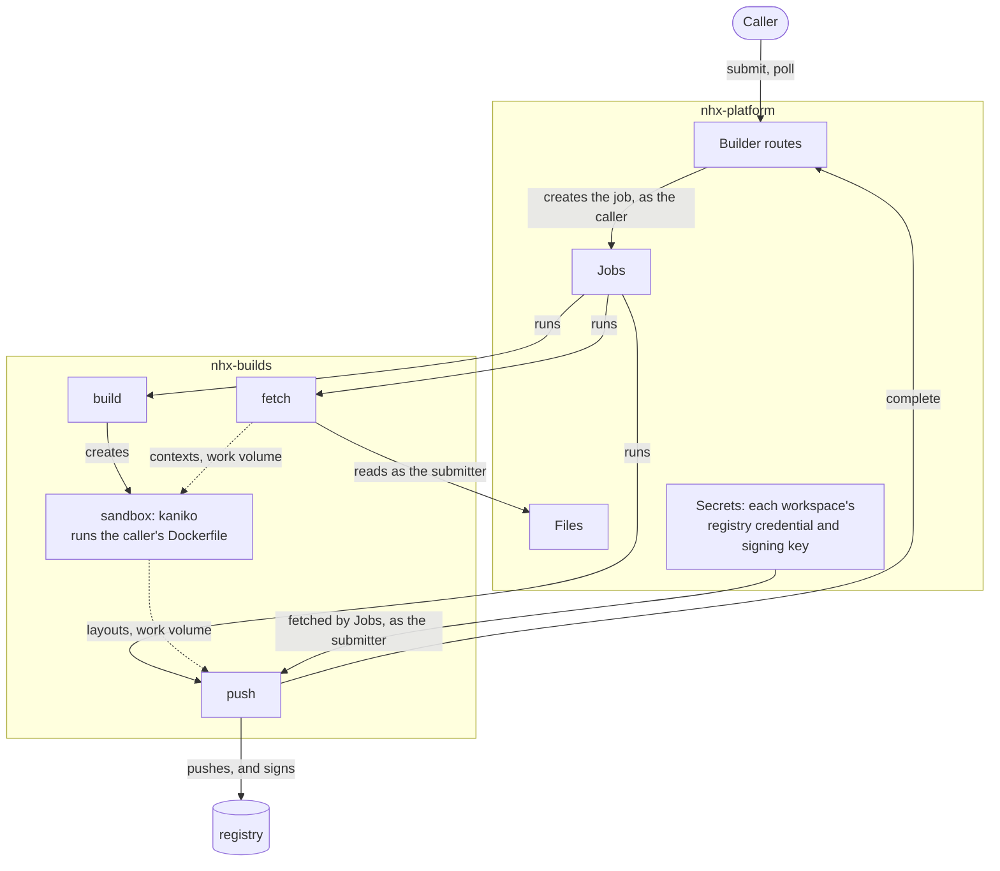
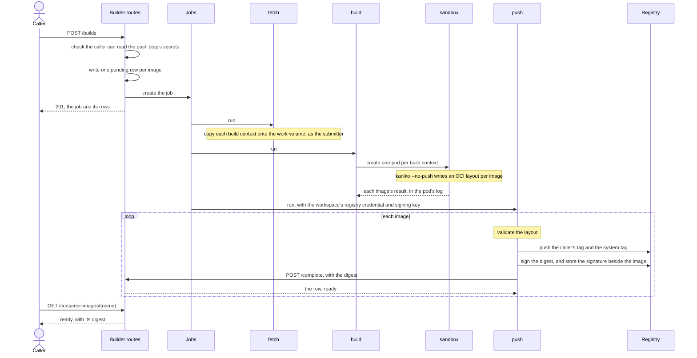

<!-- SPDX-FileCopyrightText: Copyright (c) 2025-2026 NVIDIA CORPORATION & AFFILIATES. All rights reserved. -->
<!-- SPDX-License-Identifier: Apache-2.0 -->

# NeMo Builder Plugin

Container image builds for NeMo Helix. You submit Dockerfiles whose build context is in a Files
fileset. The plugin builds them with kaniko, in a sandbox pod that holds no credentials. Then it
pushes each image to the deployment's registry, signs it with your workspace's key, and records it
as a `ContainerImage` you can pin by digest.

**Status: proof of concept.** It runs end to end on minikube. It isn't a uv workspace member or in
the Helm chart, and it has the [limitations](#limitations) listed below.

## Quickstart (minikube)

This runs the platform with the builder, and a registry, inside minikube. It builds one image and
checks the result. Run the commands from the repository root, in one shell: later steps use
variables that earlier ones set.

You need Docker with the default buildx driver, minikube, `kubectl`, `openssl`, `jq`, and the `nemo`
CLI (`make bootstrap`; see [SETUP.md](../../SETUP.md)). The cluster uses 3 CPUs and 5.5 GB of
memory. Sandboxes resolve names with `8.8.8.8` and `1.1.1.1`, so your network must allow DNS to
them; some corporate networks and VPNs don't.

**1. Cluster.** The work volume is `ReadWriteOnce`, so every build pod runs on the node labelled
`nhx.nvidia.com/build-node=true`.

```bash
minikube start --driver=docker --cpus=3 --memory=5500
kubectl label node minikube nhx.nvidia.com/build-node=true
```

**2. Images.** Build the platform image with this plugin added, the image the build steps run in,
and the sandbox's kaniko image. On an x86 machine, use `linux/amd64` instead of `linux/arm64`.
`Dockerfile.platform` starts `FROM` the local `my-registry/nhx-api:local`, which only the default
`docker` buildx driver can see; if a `docker-container` builder is selected, run
`docker buildx use default` first.

```bash
# nhx-api, with the Studio UI stubbed out; the builder doesn't use it
mkdir -p /tmp/empty-studio/artifacts && touch /tmp/empty-studio/artifacts/.keep
docker buildx bake -f docker-bake.hcl nhx-api-docker --load \
  --allow=fs.read=/tmp/empty-studio --set '*.platform=linux/arm64' \
  --set nhx-api-docker.contexts.nhx-studio-ui=/tmp/empty-studio

docker buildx build --platform linux/arm64 -f plugins/nemo-builder/docker/Dockerfile.platform \
  --build-arg NHX_API_IMAGE=my-registry/nhx-api:local -t nhx-api-builder:local --load .
docker buildx build --platform linux/arm64 -f plugins/nemo-builder/docker/Dockerfile \
  -t nhx-build:local --load .
docker buildx build --platform linux/arm64 -f plugins/nemo-builder/docker/Dockerfile.kaniko \
  -t nhx-kaniko:local --load plugins/nemo-builder/docker

minikube image load nhx-api-builder:local
minikube image load nhx-build:local
minikube image load nhx-kaniko:local
```

`minikube image load` doesn't reliably replace an image already loaded under the same tag. When you
rebuild, use a new tag, and update `deploy/` and the config to match.

**3. Keys and a password.** All for this cluster only, kept in a temporary directory rather than the
repository: a signing key pair, a password for the registry, and the registry's password file. Keep
`$KEYS/signing.pub` to verify signatures later.

```bash
KEYS=$(mktemp -d)
openssl ecparam -name prime256v1 -genkey -noout | openssl pkcs8 -topk8 -nocrypt -out "$KEYS/signing.key"
openssl pkey -in "$KEYS/signing.key" -pubout -out "$KEYS/signing.pub"
REGISTRY_PASSWORD=$(openssl rand -hex 16)
printf '%s\n' "$REGISTRY_PASSWORD" | docker run --rm -i httpd:2.4-alpine htpasswd -niB builder > "$KEYS/htpasswd"
```

**4. Deploy.** `deploy/` has one manifest per namespace:

| File | Namespace | What runs there |
|---|---|---|
| `builds.yaml` | `nhx-builds` | The build jobs and their sandboxes, with the step ServiceAccounts, their RBAC, and the work volume |
| `platform.yaml` | `nhx-platform` | The platform services the builder uses, in one pod with SQLite |
| `registry.yaml` | `nhx-registry` | A registry at `registry.nhx-registry.svc.cluster.local:5000` that takes a username and password |

```bash
kubectl apply -f plugins/nemo-builder/deploy/
kubectl -n nhx-platform create configmap nemo-helix-config \
  --from-file=config.yaml=plugins/nemo-builder/config/platform-config.minikube.yaml
kubectl -n nhx-registry create secret generic registry-htpasswd --from-file=htpasswd="$KEYS/htpasswd"

kubectl -n nhx-registry wait --for=condition=Ready pod --all --timeout=300s
kubectl -n nhx-platform wait --for=condition=Ready pod -l app=nemo-helix --timeout=600s
kubectl -n nhx-platform port-forward svc/nemo-helix 8080:8080 >/dev/null &
export NHX_BASE_URL=http://localhost:8080
```

Pods waiting on a Secret or ConfigMap made after them start once it exists, so wait on the pods, as
above, rather than on the rollouts, whose progress deadline can pass first. The port-forward runs in
the background until the shell exits.

**5. Your workspace's secrets.** The push step logs in to the registry, and signs, with three
platform secrets in the workspace that submits the build:

```bash
nemo secrets create builder-registry-username --workspace default --value builder
printf '%s' "$REGISTRY_PASSWORD" | nemo secrets create builder-registry-password --workspace default --from-file -
nemo secrets create builder-signing-key --workspace default --from-file "$KEYS/signing.key"
```

**6. Build context.**

```bash
CTX=$(mktemp -d) && cat > "$CTX/Dockerfile" <<'EOF'
FROM docker.io/library/python:3.13-slim
RUN pip install --no-cache-dir six==1.16.0
RUN echo "hello from nemo-builder" > /hello.txt
EOF
nemo files filesets create hello-context --workspace default
nemo files upload "$CTX/" hello-context --workspace default
```

**7. Build.** A spec's `platform` defaults to `linux/amd64`. On an arm64 machine, its `RUN` steps
work only if the node can run amd64 binaries, as Docker Desktop's emulation does; otherwise add
`"platform": "linux/arm64"` to the spec.

```bash
curl -s -X POST "$NHX_BASE_URL/apis/builder/v2/workspaces/default/builds" \
  -H 'Content-Type: application/json' \
  -d '{
    "name": "hello",
    "revision": 1,
    "build_specs": [
      {
        "source": {"fileset": "hello-context"},
        "output": {"repository": "demo/hello", "tag": "v1"}
      }
    ]
  }' | jq '{job, images: [.images[] | {name, status}]}'
```

`kubectl -n nhx-builds get pods -w` shows the `fetch` pod, then `build` with its sandbox, then
`push`. Poll the image until it leaves `pending`, which takes a minute or two:

```bash
curl -s "$NHX_BASE_URL/apis/builder/v2/workspaces/default/container-images/hello-1" \
  | jq '{status, digest, status_detail}'
```

```json
{
  "status": "ready",
  "digest": "sha256:4c9b935d53ba5b129d7d8d68a5da8034103817d319623a6591650dd2b306c49d",
  "status_detail": null
}
```

**8. Check the result.** The registry should serve the recorded digest, the signature should verify
against your public key, and the image should contain the Dockerfile's output:

```bash
DIGEST=$(curl -s "$NHX_BASE_URL/apis/builder/v2/workspaces/default/container-images/hello-1" | jq -r .digest)
kubectl -n nhx-registry run check --rm -i --restart=Never --image=nhx-build:local \
  --env="PASSWORD=$REGISTRY_PASSWORD" --env="DIGEST=$DIGEST" --env="PUB=$(cat "$KEYS/signing.pub")" --command -- sh -c '
  set -e; export HOME=/tmp
  REG=registry.nhx-registry.svc.cluster.local:5000 REF=registry.nhx-registry.svc.cluster.local:5000/default/demo/hello
  crane auth login "$REG" -u builder -p "$PASSWORD" >/dev/null 2>&1
  V1=$(crane digest --insecure "$REF:v1")
  [ "$V1" = "$DIGEST" ] || { echo "v1 is $V1, not the recorded $DIGEST" >&2; exit 1; }
  echo "$PUB" > /tmp/signing.pub
  cosign verify --key /tmp/signing.pub --insecure-ignore-tlog=true --allow-http-registry "$REF@$DIGEST" \
    >/dev/null 2>/tmp/verify.log || { cat /tmp/verify.log >&2; exit 1; }
  echo "v1 is $DIGEST, and its signature verifies"
  crane export --insecure "$REF:v1" - | tar -xO hello.txt'
```

On success it ends with `v1 is sha256:…, and its signature verifies` and `hello from nemo-builder`.
If the digests differ or the signature doesn't verify, it says so and exits non-zero.

To build again, submit with `"revision": 2`.

## Using the API

There's no CLI or SDK accessor yet. All routes are under `/apis/builder/v2/workspaces/{workspace}`.

### Submit a build: `POST /builds`

A request is a `BuildSet`: a name, a revision, and up to 100 `BuildSpec`s. The set runs as one Jobs
job, and each spec becomes one `ContainerImage` row.

```json
{
  "name": "hello",
  "revision": 1,
  "build_specs": [
    {
      "name": "main",
      "source": {"fileset": "hello-context", "context_path": null},
      "dockerfile": "Dockerfile",
      "platform": "linux/amd64",
      "output": {"repository": "demo/hello", "tag": "v1"}
    }
  ]
}
```

| Field | Meaning |
|---|---|
| `name` | What is being built. Reused across rebuilds. Lowercase letters, digits and single hyphens, starting with a letter, and short enough that every name built from it fits in 63 characters. |
| `revision` | Your own version number for `name`, starting at 1. Use a new revision for every build. |
| `build_specs` | Up to 100 specs. |
| `build_specs[].name` | The image's name within the set, unique in it: lowercase letters and digits, joined by single `.`, `_` or `-`. It names the image's row, `<name>-<revision>.<spec>`, and an image with no `output` is published under it. One spec in a set may leave it out; its row is `<name>-<revision>`. |
| `source.fileset` | The fileset holding the build context: `name` in this workspace, or `workspace/name`. |
| `source.context_path` | Optional subdirectory of the fileset to use as the context. Relative, with no `..`. Omit it to use the whole fileset. |
| `dockerfile` | Path relative to the context. Absolute paths and `..` are rejected. Defaults to `Dockerfile`. |
| `platform` | Passed to kaniko. Defaults to `linux/amd64`. |
| `output.repository`, `output.tag` | Optional. Where the image is published, within your workspace's part of the registry. Tags containing `--` or starting with `sha256-` are reserved for system tags and signatures. |

A misspelt field is a `422`, never silently ignored.

Every image goes to the deployment's one registry. With an `output`, it goes to
`<registry>/<repository_prefix>/<workspace>/<output.repository>:<output.tag>`. Without one, it goes
to `<registry>/<repository_prefix>/<workspace>/<name>/<build_specs[].name>`, or
`<registry>/<repository_prefix>/<workspace>/<name>` for the unnamed spec, under the system tag only.
You can't name a registry: whatever runs the image has to pull it, and one registry means one pull
credential for every workload.

A successful submit returns `201` with the job's name and the `pending` rows. Poll the rows, not the
job: images in a set finish independently.

| Status | When |
|---|---|
| `201` | Rows created and job submitted, or the same request was submitted before and these are its rows and job. |
| `400` | Two specs would publish the same `repository:tag`, or the workspace name can't be a repository path component. |
| `403` | You may submit builds but may not create jobs in the workspace. |
| `409` | The deployment can't build: `registry` or `sandbox_image` is unset. Or the push step's secrets don't exist in the workspace, or you can't read them. Or this `name` and `revision` were already submitted with a different request, or the job's name is held by a job this request didn't create; any rows this request wrote are then failed. |
| `422` | The body failed validation: for example a path outside the context or fileset, a set or spec name that doesn't fit, more than 100 specs, duplicate spec names, a `revision` below 1, a repository or tag that isn't valid or is reserved, or an unknown field such as `output.registry`. |
| `502` | Another platform service refused the build. |
| `500` | Anything else. |

### Read the results: `GET /container-images` and `GET /container-images/{name}`

`GET /container-images` takes `page` and `page_size` (at most 100), and two filters: `job`, a job
name a submit returned, and `status`. `GET /container-images/{name}` returns `404` for a name that
doesn't exist. Each row is a `ContainerImage`:

| Field | Meaning |
|---|---|
| `status` | `pending`, `ready` or `failed`. `ready` is written once the push step has pushed and signed the image; `failed` only when the submit that wrote the row was refused. Both are final. |
| `status_detail` | Why a row failed. |
| `registry`, `repository` | Where the image lives. |
| `digest` | The digest the push step pushed and signed, set once when the row becomes `ready`. Pin `<registry>/<repository>@<digest>`. |
| `platform` | The platform the image was built for. |
| `provenance` | The build set, revision, spec and job that produced the image, and `request_digest`, the digest of the request. `spec` is null for the unnamed spec. |

Names come from the request:

| | Pattern | Example |
|---|---|---|
| Job | `<set>-<revision>` | `hello-1` |
| Row | `<set>-<revision>.<spec>`, or `<set>-<revision>` for the unnamed spec | `hello-1.tests`, `hello-1` |
| System tag | `<workspace>--<row>` | `default--hello-1` |

## How a build runs

A submitted build set becomes one Jobs job with three steps, each under its own ServiceAccount. Your
Dockerfile runs in a fourth pod, the sandbox, which isn't a job step and holds nothing.





1. **Submit.** The request is resolved into a job name and a row name per image, and each image is
   placed: registry, repository and system tag. Anything the deployment can't honor is refused
   before anything is written, including a push step secret the caller can't read. Then one
   `pending` row per image is written, then the job. Each row records a digest of the request, so
   the same request submitted again returns the same rows, and a different request under the same
   `name` and `revision` is refused.
2. **`fetch`** clears what an earlier run left behind, then copies each fileset, or just its
   `context_path`, onto the work volume as the submitter. A fileset the submitter can't read fails
   here.
3. **`build`** creates one sandbox per distinct fileset and `context_path`. The sandbox runs kaniko
   once per image with `--no-push`, writing an OCI layout to that image's output directory. The
   sandbox has:
   - no ServiceAccount token, environment variables or secrets
   - a security context the `baseline` Pod Security Standard admits: root, but with only five
     capabilities, `RuntimeDefault` seccomp and no privilege escalation
   - public DNS resolvers rather than cluster DNS
   - a deadline the kubelet enforces, so it ends even if `build` is killed first
4. **`push`** treats each layout as untrusted. It refuses symlinks, special files, blobs that don't
   hash to their names, and anything but a single manifest. For each image it pushes the caller's
   tag and the system tag with crane, signs the digest, and asks the builder to complete the image.
5. **Completing** writes the row `ready` at the digest the push step names, in one write.

One failed Dockerfile doesn't stop the rest of the set: the other images still build, push and
complete. The failed image's row stays `pending` (see [Reliability](#reliability)). If every image
in a set fails, `push` never runs.

| | Runs as | Holds | Work volume | Runs your code |
|---|---|---|---|---|
| `fetch` | `nhx-build-fetch` | a Files client, acting as the submitter | yes | no |
| `build` (runs `nhx-build supervise`) | `nhx-build-control` | permission to manage pods in `nhx-builds` | no | no |
| sandbox (kaniko) | no ServiceAccount token | nothing | its own context read-only, and one output directory per image | yes |
| `push` | `nhx-build-push` | the workspace's registry credential and signing key | yes | no |

## Publishing and signing

The push step is the only step with a credential. Before it starts, Jobs fetches three platform
secrets from the job's workspace, as the submitter, and gives them to the push step as environment
variables. The step reads them, then removes them from its environment, so no tool it runs inherits
them. They are named by the deployment's settings; by default:

| Secret | Holds |
|---|---|
| `builder-registry-username` | The username the push step logs in to the registry with. |
| `builder-registry-password` | That username's password or token. |
| `builder-signing-key` | A PEM private key, EC or RSA, unencrypted, that the push step signs every image with. |

For each image, the push step:

1. **Pushes** the caller's tag, then the system tag, with crane. crane logs in as the registry asks:
   with the credential itself, or with a token from the registry's token service.
2. **Signs** the digest it pushed, in cosign's format, every annotation taken from the image's row:
   its workspace, name, build set, revision, job and request digest. It stores the signature beside
   the image, under `sha256-<digest>.sig`, where `cosign verify` looks for it. Nothing goes to a
   transparency log.
3. **Completes** the image: `POST /container-images/{name}/complete` with `{"digest": "sha256:…"}`.

Verify an image with the workspace's public key:

```bash
cosign verify --key signing.pub --insecure-ignore-tlog=true <registry>/<repository>@<digest>
```

`complete` needs `builder.container-images.complete`, which the Editor role has. With platform auth
on, the caller must also be a job step acting for the image's submitter: a user's own token is
refused. Completing an image already `ready` at that digest returns it, so a retry is safe. The
builder doesn't read the registry: it records the digest the push step names.

| Status | When |
|---|---|
| `200` | The image is `ready` at the digest, now or already. |
| `403` | The caller isn't a job step acting for the image's submitter. |
| `404` | No such image. |
| `409` | The image has already settled: `ready` at another digest, or `failed`. |
| `422` | The body is anything but a sha256 digest. |

## Deploying

### Configuration

Operator settings live under `builder:` in the platform config, or in `NEMO_BUILDER_*` environment
variables. Callers can't set any of them.

```yaml
builder:
  namespace: nhx-builds
  work_pvc: nhx-build-work
  sandbox_image: my-registry/nhx-kaniko:v1.25.19 # built from docker/Dockerfile.kaniko
  registry: us-central1-docker.pkg.dev           # a host only, never host/path; http://host for plain HTTP
  repository_prefix: my-project/my-repo          # images land at <prefix>/<workspace>/...
  # The push step's platform secrets, in the submitting workspace. These are the defaults.
  registry_username_secret: builder-registry-username
  registry_password_secret: builder-registry-password
  signing_key_secret: builder-signing-key
```

`registry` and `sandbox_image` have no default; while either is unset, submits fail with a `409`
rather than as builds that die in a pod. Set `repository_prefix` to a path dedicated to builds: left
empty, each workspace name is a top-level namespace in the registry. The other settings are
`sandbox_cpu`, `sandbox_memory`, `sandbox_dns_nameservers` and `node_selector`, each described on
`BuilderConfig` in `config.py`.

`config/platform-config.minikube.yaml` is the quickstart's config. It works, but it is local-only in
the ways its header lists, auth being off among them; don't start a shared deployment from it.

### Each workspace's secrets

A workspace that builds needs the three secrets in
[Publishing and signing](#publishing-and-signing), created with `nemo secrets create` as in step 5
of the quickstart. Until it has them, its submits fail with a `409` naming what is missing. Any
member who can run jobs in the workspace and read its secrets can read these, through a job of their
own.

Give each workspace a registry credential that can write only its own part of the registry,
`<repository_prefix>/<workspace>/`, where the registry allows it: a Harbor project and robot
account, an Artifact Registry repository and service account, or an Artifactory permission on that
path. A credential that can write more lets that workspace's builds, and members, overwrite other
workspaces' images.

### Registries

The registry must accept nested repository paths and create a repository on its first push, as
Artifactory, GAR, Harbor and Distribution do. Docker Hub and nvcr.io don't: each repository there
must be created first, and names have a fixed depth. Known differences:

| Registry | Credential | Note |
|---|---|---|
| GAR | `_json_key` and a service account key, or `oauth2accesstoken` and an access token | An access token expires within an hour, so the secret needs refreshing. |
| Harbor | A robot account | A robot's permissions are per project. |
| Artifactory | A username and an identity token | Writes are slow: a manifest has taken two minutes to be accepted. |
| nvcr.io | `$oauthtoken` and an NGC API key | Repositories are exactly `<org>/<team>/<image>`, so the workspace must be named for the team and `repository_prefix` for the org. |

### Jobs execution profiles

The platform needs three Jobs execution profiles, one per step, named by `fetch_profile`,
`control_profile` and `push_profile` (`build-fetch`, `build-control` and `build-push` by default).
Each is a `cpu` profile on the `kubernetes_job` backend, and they must agree with the builder config
and the manifests:

- `namespace` is the builder's `namespace`, and `storage.pvc_name` is its `work_pvc`
- `service_account_name` is `nhx-build-fetch`, `nhx-build-control` or `nhx-build-push`
- `default_task_image` is the `nhx-build` image, and `launcher_image` an image that ships
  `/tools/jobs-launcher`, as the platform image does
- `node_selector` is the build node's label

## Limitations

### Deployment

- **Kubernetes only, with the platform inside the cluster.** Build pods call back to Files, Jobs and
  the builder, so a control plane outside the cluster can't run builds.
- **One build node.** The work volume is `ReadWriteOnce`. A `ReadWriteMany` volume would lift this.
- **One registry per deployment.** Every image is published to `registry`, under the submitting
  workspace's path. Publishing anywhere else means copying the image out afterwards.
- **Each new request needs a new `revision`.** The same request again returns its rows; a different
  one under a used `name` and `revision` returns `409`.

### Reliability

- **Nothing fails a row whose build fails.** Its row stays `pending`. So do the rows of a submit
  that died between writing them and creating its job, and the rows of a job whose push step never
  started, because a secret was deleted after the submit checked it. Poll with a deadline.
- **`build` gives up on a dropped watch, and on a leftover sandbox.** If its watch on a sandbox
  closes early, the sandbox's unfinished images fail. A retried `build` step fails while the
  previous attempt's sandbox still exists.
- **`fetch` reads each file whole into memory.** A build context with very large files can exhaust
  the step's memory.

### Security

- **A signature says a member of the workspace, or one of its builds, signed the image.** The
  signing key is a workspace secret, so any member who can run a job that reads it can sign any
  image with it. A signature doesn't show that the platform built the image.
- **With platform auth off, anything can complete an image.** Nothing then checks who calls
  `complete`, so anything that reaches the platform, a build's own `RUN` included, can mark a
  `pending` image `ready` at a digest of its choosing. Such a digest carries no signature from the
  workspace's key, so verify signatures, not just digests. The quickstart runs with auth off.
- **Platform auth on doesn't work yet.** The jobs launcher fetches the push step's secrets with the
  step's delegated identity, which Jobs doesn't give a step when workload token exchange is on.
  Without exchange, the step gets its secrets, but `complete` refuses it: only the exchanged token
  says a step acts for the submitter.
- **Any job step acting for an image's submitter can complete it.** The platform's workload token
  says whom a step acts for, not which job it belongs to.
- **Execution profiles aren't authorized in Jobs.** Anyone who can submit a build can run a raw job
  under any of the builder's profiles. Under `build-control` such a job can create any pod in
  `nhx-builds`: it can mount the whole work volume, with every build's contexts and outputs, and
  rewrite a layout another job's push step is about to publish; read any build pod's log; and
  delete any build pod. Closing it needs Jobs to restrict these profiles to the builder.
- **Nothing restricts the sandbox's network.** A Dockerfile's `RUN` can reach anything a pod can:
  the platform, every other Service, and on a cloud cluster the node's metadata server. A
  NetworkPolicy allowing the sandbox only public addresses would close this; the sandbox already
  resolves names with public DNS, and carries the label `nhx.nvidia.com/sandbox=true` to select it
  by.
- **Images built from one context share a sandbox.** Each one's `RUN` can reach the others' outputs,
  so one image's Dockerfile, or a base image it pulls, can alter another image of the same build.
- **Base images must be pullable without credentials.** The sandbox holds none, and nothing bounds
  what a Dockerfile can pull `FROM`.

### Not yet supported

- **KMS keys.** The signing key is a PEM in the platform's Secrets service, and the push step holds
  it while it runs.
- **Signatures in a transparency log, or in cosign's newer formats.** Signatures are cosign's legacy
  `.sig` images.
- **Multi-platform images.** Each spec builds one platform.

## Development

The plugin isn't a uv workspace member. The root `pytest.ini` and `ty` config put its `src/` on the
path instead, so the repository's unit tests collect these tests, and nothing needs installing:

```bash
uv run --frozen pytest plugins/nemo-builder/tests
uv run --frozen ruff check plugins/nemo-builder && uv run --frozen ty check plugins/nemo-builder
```

The tests need no cluster, registry or running platform.

| File | What it holds |
|---|---|
| `service.py` | The REST routes |
| `_perms.py`, `authz.py` | The routes' permissions, and the plugin's authz scope |
| `schema.py` | The request models: `BuildSet`, `BuildSpec`, `FileSetSource`, `BuildOutput` |
| `plan.py` | `BuildPlan`: a request resolved into names, then placed by the backend |
| `backend.py` | The backend interface: what a backend refuses, compiles and places |
| `backends.py`, `execution.py` | The deployment's backend, and the `execution` backend |
| `compile.py` | Turns a plan into the three-step `HelixJobSpec`, as a pure function |
| `submit.py` | The submit sequence: plan, secrets, rows, then the job |
| `completion.py` | Who may complete an image, and the one write that makes its row `ready` |
| `signing.py` | What a signature says, cosign's format for storing it, and the key that makes it |
| `registry.py` | The registry calls the push step makes to store a signature |
| `registry_auth.py` | Logging in to a registry with a username and password, as its challenge asks |
| `client.py` | A typed client for the builder's routes, which the push step uses |
| `steps.py` | What each step's config contains, the push step's environment, and `WorkLayout` |
| `entities.py` | `ContainerImage` |
| `identity.py` | Registry hosts, repository paths and tags, and the system tag |
| `config.py` | `BuilderConfig` |
| `run/` | The programs: `fetch.py`, `supervise.py` and `push.py`; `main.py`, the `nhx-build` entry point; `context.py`, what the steps share; and `tools.py`, which runs crane for `push` |
| `docker/` | The `nhx-build` image, the sandbox's kaniko image, and the platform image with this plugin added |
| `deploy/` | The quickstart's manifests, one per namespace |
| `config/` | The platform config for the minikube quickstart |
